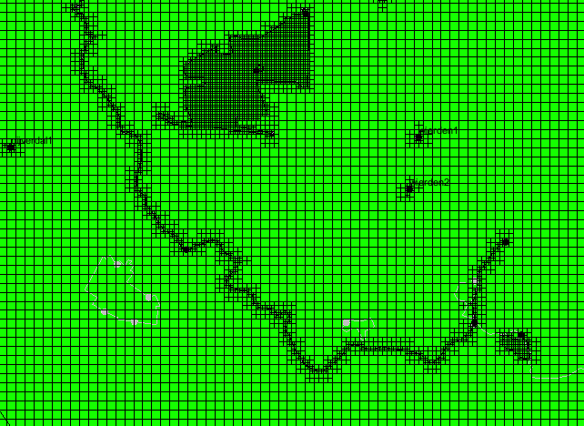

# Creating Ugrid

Modflow 6 grid generation is based on Ugrid, which can be unstructured.
Moreover, it is no longer necessary to have the same number of layers at
every location. This means that for example local ice pushed ridges at
and near the Holterberg can be assigned to his own locally present
layers.

Setting up a Ugrid requires choosing which type of grid cells are
required. Except for the original layering (rows, columns and layers)
one could choose:

-   Voronoi

-   Quadtree

-   Octree

We are using Quadtrees and using local refinement at the nature reserves
(Wierdens veld, Mokkelengoor), the Regge and at the well locations. For
the nature reserves and the Regge we are assigning "refinement" to their
arcs. Also for the wells, local refinement is applied for the nodal
distances.

## Polygons, arcs and points

To create an unstructured grid with Quadtree/Octree refinement should be
checked in the coverage where all polygons (whole domain of the model,
Wierdense veld, Mokkelengoor), arcs (Regge) and points (Vitens' wells)
should be checked.

The general set up of this coverage would then be:

After creating the new GMS-coverage, you can use the "copy to coverage"
to create a copy of the domain and nature reserve polygons and the Regge
arcs to the new coverage. To avoid confusion you can remove all
hydroligal features (fixed head, river stage, well rate) from the
points, arcs and polygons, since they are not used during the generation
of the 2DUgrid.

You could also use the original shape files for the nature reserves and
the Regge.

### Nature reserve polygons

-   Be sure that the polygons are all polygons and not just connected
    arcs

The attribute table for the selected polygons should look like this:

Although the whole model domain requires a nodal distance, it is not
necessary to set this here. During the step to map this coverage to the
2DUgrid, the general nodal distance in X and Y can be set for the
domain.

The actual base size can be altered. Note that when using
Quadtree/Octree the nodal distance reduces with 50% during each
refinement step, ending close to the chosen "Base size". For example, if
your domain has a nodal distance of 250m the first refinement step
creates 125m cells, followed by about 60\~65, \~30, etc.

### Open water arcs

It is suggested to use a similar refinement for the Regge. Not that the
Regge contains an arc for every reach (from weir to weir).

### Well points

Finally, the nodes where the wells are located will receive a grid
refinement.

The Base size is defines the nodal distance/grid size at the well. Since
we are using Quadtree/Octree the refinement steps are always 50% of the
previous grid size, meaning that Bias (the fraction of size growth 1.1
means 10%) and Max size are not used (*as far as I know).* When
"Voronoi" type of cells are used these do play a role.

## Mapping the refinement to a 2DUgrid

Select the Grid Frame, fit it to the active coverage (i.e. the coverage
with the domain and all the refinements and select UGrid

Be sure to set a 2D grid at "Dimension" and "UGrid type" to
Quadtree/Octree. For cell size, you may use 250 or 200.

The resulting 2DUgrid should be similar as shown in the following clip:

# Creating a new MODFLOW6 simulation

Having the 2DUgrid created, the following steps of setting up a modflow6
model can now be carried out

To set up a new modflow 6 simulation several major steps need to be
taken;

1.  Setting up a new modflow6 simulation

2.  Assigning the layer elevations to the 3D_Ugrid

3.  Assigning the package data to the model (CHD, DRN, RIV, WEL, RCH)

4.  Save, Check and Run this new modflow6 model

5.  Analyse the results

    1.  heads

    2.  flow budgets

## Setting up a new modflow6 simulation

1.  Create a new (mf6) simulation by right clicking in the explorer
    window and selection "New Simulation"

    1.  Select the appropriate 2DUgrid and packages:{width="700"} This results
        in the appropriate data sets to fill the modflow 6 model with
        the Wierden coverage data.

After assigning the layer elevations to the model, these packages will
be loaded with the GMS-coverages created during the basic Wierden model.

## Assigning the layer elevations to the 3DUgrid layers

Although the title above mentions "layer", with the use of an
[U]{.underline}nstructured grid; UGrid it is not mandatory to have the
same number and aligned layers as with the original structured grid used
in modflow_nwt or older.

In the Wierden case, it is now possible to have the ice pushed ridge
elevations (Holterberg) assigned to local grid cells/volumes only!

Make sure that the following raster files are loaded into GMS:

-   surface_elevation.tif

-   top_ridge.tif

-   bot_ridge.tif

-   top_imp_layer_5.tif

-   geohydrological_base.tif

The fourth elevation raster, denotes the boundary between the upper and
lower aquifer. These data come from the Landelijk Hydrologisch Model
(LHM4.3) which is a national groundwater model of the Netherlands and
contains 8 different aquifer layers. For this course these layers are
aggregated to two aquifers.

1.  Select the "3D Ugrid from Raster" tool (in the Unstructured grid
    folder) from the Toolbox; and click on "run"

2.  Select the 2D Ugrid with the refinements (its probably the only
    2DUgrid)

3.  Add 5 raster files locations the the "plus" sign button

4.  Select the individual raster in the order from bottom (the base of
    the model) to the top (surface elevation)

5.  Set the minimal thickness to : 0.0 Which makes that the ice pushed
    ridge elevation will only appear locally near e.g. the Holterberg

6.  Give a name for this 3DUgrid /modflow 6 "flow" simulation

The final settings in the tool should look like the clip below:

This should result in the following stratigraphical build-up, red: upper
aquifer, blue: ice pushed rigdes, green: lower aquifer:

The clip below clearly shows that the ice pushed ridge formation is only
locally present, not having layer(s) continuing the model boundaries;

In the clip above, it is clearly visible that the ice pushed ridges are
only locally present.

## Assigning the package data to the model (CHD, DRN, RIV, WEL, RCH)
