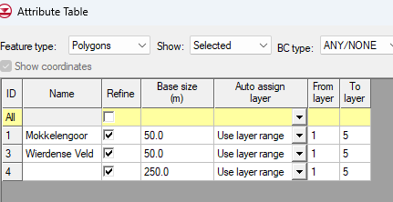
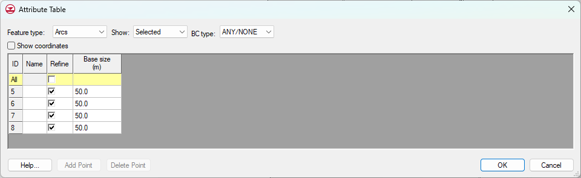
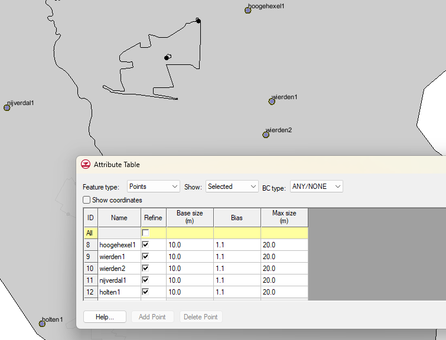
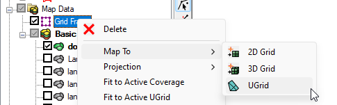
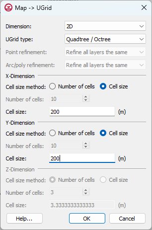
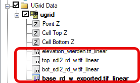

# Creating Ugrid

Modflow 6 grid generation is based on Ugrid, which can be unstructured.
Moreover, it is no longer necessary to have the same number of layers at
every location. This means that for example local ice pushed ridges at
and near the Holterberg can be assigned to his own locally present
layers.

Setting up a Ugrid requires choosing which type of grid cells are
required. Except for the original layering (rows, columns and layers)
one could choose:

-   Voronoi

-   Quadtree

-   Octree

We are using Quadtrees and using local refinement at the nature reserves
(Wierdens veld, Mokkelengoor), the Regge and at the well locations. For
the nature reserves and the Regge we are assigning "refinement" to their
arcs. Also for the wells, local refinement is applied for the nodal
distances.

## Polygons, arcs and points

To create an unstructured grid with Quadtree/Octree refinement should be
checked in the coverage where all polygons (whole domain of the model,
Wierdense veld, Mokkelengoor), arcs (Regge) and points (Vitens' wells)
should be checked.

[*dd 2-12-25 I think only refinement is ok, since this ugrid must be a
2dugrid. this means that only grid properties are assigned to the ugrid.
Later on a 3dugrid is created based on this 2dugrid with local
refinements and the rasters of the layer elevations in the
subsoil*]{.smallcaps}

The general set up of this coverage would then be:

-   Be sure that the polygons are all polygons and not just connected
    arcs

The attribute table for the selected polygons should look like this:
(*well... layer range is not required)*

The actual base size can be altered. Note ID 4 has no name but is the
polygon of the whole domain.

The Regge (the only multi arc) should have similar refinement set.
Actual refinement can be altered.

Finally the nodes where the wells are located will receive a grid
refinement.

Note that, in this case, seem to have well type extraction rate and well
screen "active" Forgot the uncheck wells but somehow at this stage it
doesn't matter..

Select the Grid Frame, fit it to the active coverage (i.e. the coverage
with the domain and all the refinements and select UGrid

Set the following window should appear. Use the same settings.

This should result in the same refinements in each later for points
(wells), Arc's (Regge), Arc/poly -\> nature reserves and for the whole
domain, here 247m. ~~Be sure to map 5 cells, which are 5 layers.~~ Since
we have only 3 formations we will first create a Ugrid with 3 layers.
Later on, we can split layers.

This result in the following Ugrid:

# Creating a new MODFLOW6 simulation

To set up a new modflow 6 simulation several steps need to be taken;

1.  Setting up a new modflow6 simulation

    1.  Check all the required packages. Be aware that "IBOUND" is not
        available so "CHD" should be used instead

2.  Assigning the layer elevations to the Ugrid layers

3.  Assigning the all (GMS) coverage data to the model (CHD, DRN, RIV,
    WEL, RCH,..)

4.  Run this new modflow6 model

5.  Analyse the results

    1.  heads

    2.  flow budgets

## Setting up a new modflow6 simulation

1.  Create a new (mf6) simulation by right clicking in the explorer
    window and selection "New Simulation"

2.  Select the appropriate packages

## Assigning the layer elevations to the Ugrid layers

Basic approach is to use 2D scatter data or rasters to interpolate these
elevations to the Ugrid layers.

This approach is based on 2D scatter data which I created from the
elevation TIN's which originate from the raster files (\*.tif files).
Creating the 2D data sets from TIN's is quite simple; Select each TIN,
right-click and select "Convert To -\> 2D Scatter Points;

Next, the 2D scatter points need to be interpolated to the Ugrid. For
interpolation I use simply "linear";

This results in the following elevations to the Ugrid;

### Assigning the ugrid elevations 2 tops and bottoms

The elevations assigned to the ugrid are now ready to be mapped to the
layer (3) elevations of the modflow6 model.

The following approach should do the trick;

1.  Double click on the DISV (Vertex Grid Discretization) data set

2.  Start with the Top elevations (already selected and dimmed) of the
    upper layer of the ugrid; 

3.  Select the surface elevations dataset 

4.  Select the bottom elevation set for ugrid layer 1 

5.  
