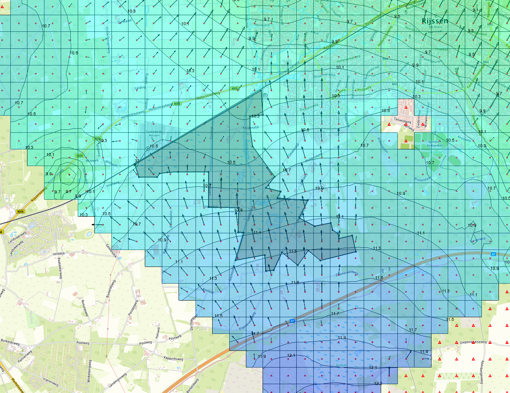
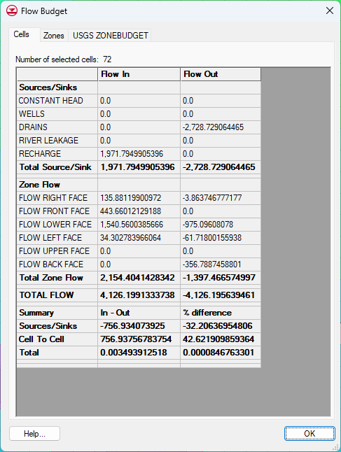
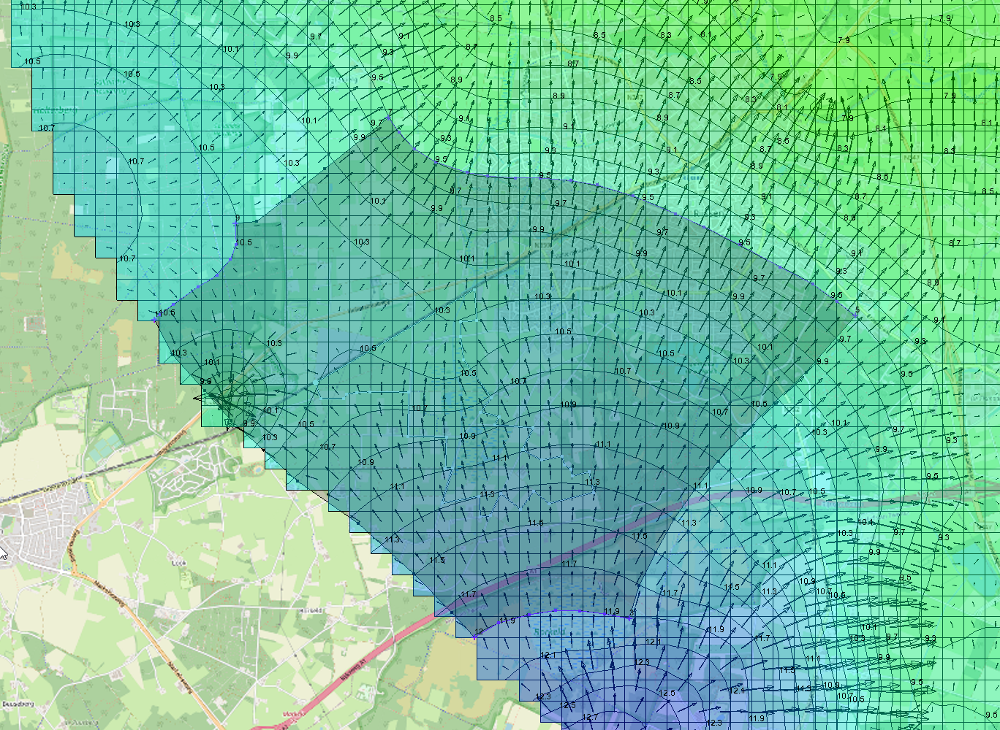
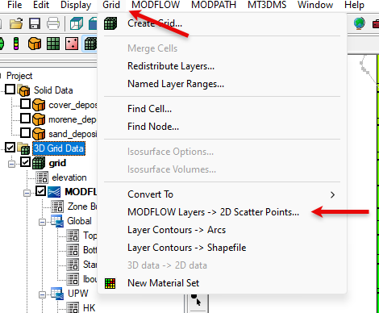
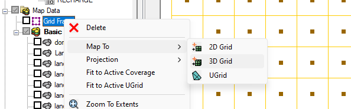
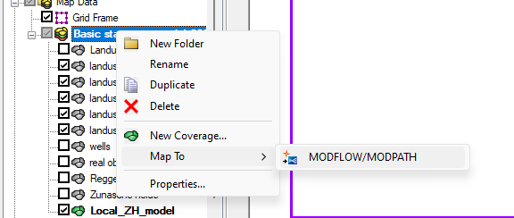
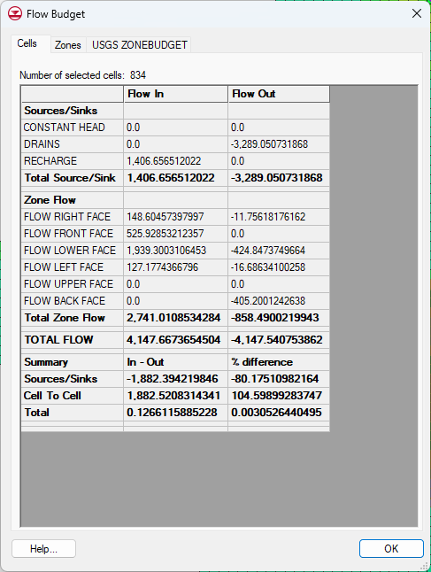
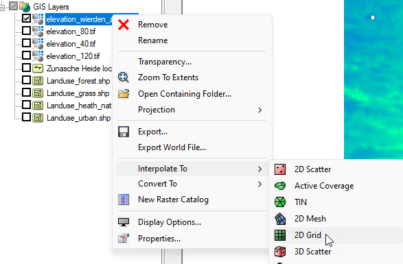

# Workout Overtoom-Middelveen {#workout-zunasche-heide}

With the basic regional stationary "wierden" model, with this workout
I'm using "new_wierden.gpr", which is based on a new solid set (more
upper aquifer material on top and a finer TIN 100 instead of 150-200 m)
and contains the LHM stationary recharge:

-   Use the Overtoom-Middelveen shape file to create a new coverage to
    identify the current Overtoom-Middelveen cells and see how the flow
    budget looks like at the current state; stationary, no adjustments
    yet (so Overtoom-Middelveen is still grass with Cdrain 150 days and
    drains tage at -80cm

-   Run this model and run flow budget:

Upward seepage is about 1540 m^3^/d and infiltration to the lower
aquifers 975 m^3^/d.

-   Select the data sets of the CCF (Cell to Cell Flow) file:

-   Select the "Flow Lower Face" (having layer 1 selected).

    -   Tweak the legend for a clearer view

In the image above, you clearly see that there is upward seepage in a
large part of Overtoom-Middelveen at this stage.

## Creating a local model for the Overtoom-Middelveen {#creating-a-local-model-for-the-zh}

1.  Run the regional/basic model to have the most recent (correct) heads
    determined

2.  Create a new coverage with CHD activated for all 5 layers.

1.  Create a a new domain for the local model enclosing
    Overtoom-Middelveen for about 1000 m. Make sure that you can apply
    both Dirichlet and Neumann boundary conditions at the perimeter of
    the new local model. It's more convenient to investigate all layers
    wrt their isohypses. Top layer is probably affected by
    top-systeems(drainage) and the Regge. Better to look at a lower one.
    Make sure that two boundaries reflect the isohypses at that
    location. The two other arc's should then be no-flow boundaries (aka
    Neumann). Flow vectors could be helpful here. Use the deepest heads
    since one wants to capture the regional flow pattern. But also check
    whether the other boundaries are more or less in line with the
    deepest layer. Three times $\lambda$ is not that necessary since we
    assume that our simulated flow is not that bad.

## Creating 2D scatterset of the regional model for interpolation {#creating-2d-scatterset-of-the-regional-model-for-interpolation}

A separate local model will be developed and therefore relevant data
from the regional model will be converted to 2D scatter sets.

These data will then be interpolated to the new (local) modflow model.

1.  Select 3D Grid Data and then open the Grid main menu

2.  From there select MODFLOW layers -\>2D Scatter Points..."

Check the "layer elevations" and "Flow package properties" and computed,
stationary heads. Here, scatter data is created for the
Overtoom-Middelveen local model only, upper checkmark..

No need to use the Layer subdivision (previous window/clip).

This results in the following 2D scatter sets:

Set the Dirichlet boundary condition arc (CHD) to the proper values.
These boundaries should now be purple.

The next step involves setting up the new local model for
Overtoom-Middelveen.

Now it's a good time to rename (save as) the model with all the loaded
data to another name (ZH_local.gpr for example)

1.  Create a new 3D grid for the local model

2.  Set the grid frame to the active coverage

2.  Create a 3D grid having a new cell size of 50 m and assign 5 layers
    to it

3.  Create a new simulation: main menu; MODFLOW\|New Simulation

4.  Select the "Map data" and make sure that the coverage containing the
    proper local Dirichlet and Neumann boundary conditions is
    active If not done
    so yet make sure to define a new modlfow simulation;

5.  Probably safer to remove the coverage containing the boundary
    conditions of the regional model. MOREOVER; sometime GMS seems to
    keep the older grid into memory making it hard to create a new. It
    could help to remove all data/maps related to the regional Wierden
    model from this local setup.

Before mapping the GMS coverages (landuse and drainage) the new model
need to have the proper layer elevations.

## Interpolate 2D scatter data to the local model {#interpolate-2d-scatter-data-to-the-local-model}

1.  Select the Regional Wierden model Scatter data and select
    "Interpolate -\> MODFLOW Layers"

One could set the Interpolation Options to simple Natural Neighbour.

Also check the RCH button above for convenience. If not, it can also be
mapped later on with the "LHM_stationary_recharge.tif" raster.

## Map the appropriate GMS-coverages to the local model {#map-the-appropriate-gms-coverages-to-the-local-model}

4.  Map all appropriate GMS coverages (landuse/drainage) to the new
    model (*just to be sure that stuff is not missed. But since the
    drainage elevations are all based on Wierden_elevations minus 40, 80
    or 100 cm, this should not affect the head calculatons drastically)*

4.  Save the data to the current model

5.  Check the new model for errors/mishaps

6.  Run the new local model

## Calculate the depth of the water table {#calculate-the-depth-of-the-water-table}

1.  Convert 3D grid model data to 2D grid for some manipulations

2.  Select grid data to calculate the water depth wrt surface

3.  Same thing with the head of the first layer

4.  Subtract them

> Currently the plot indicates that gwt is at about 0.0 -- 80 cm below
> surface in a large part of the Overtoom-Middelveen area. The
> south-eastern part has deeper groundwater tables of about 100 - 200 cm
> below surface.

The water budget now; left flow budget of Overtoom-Middelveen in the
local model. Right the one in the regional (new)Wierden model

Deviations are not that small. Since the local model has way more cell
rounding around the perimeter of Overtoom-Middelveen could play a role?
Moreover, the scatterset comes from a grid 4x coarser, so interpolation
could may be also play a considerable role here.

Below the calculated upward seepage for the regional (upper) and local
model(lower) in mm/d

This local model is called "**OM_local.gpr**"

## Removing the top soil (40 cm) {#removing-the-top-soil-40-cm}

1.  Load "elevation_wierden_zh_40.tif"

2.  Right click and select 

3.  Double click on the "Top" of the modflow layers (in the explorer
    window: 3D grid data\|Grid\|MODFLOW\|Global\|Tops). The Top
    elevation grid display appears and select "2D Dataset -\> Layer..."
    and then the 2D grid elevations based on the tif file.

4.  Save this model. You may consider saving this with a new file name.
    For example "OM_Local_no_Topsoil.gpr"

5.  Rerun the model and calculate the groundwater table depth, see
    section the previous section on this.

This procedure results in the required groundwater table below surface
with the topsoil removed:

Compared to the original surface elevation the groundwater table now
clearly is much higher. In the centre part the table even rises above
the surface at at a large part. Elevations there, are in the order of
0.0 -- 60 cm below surface. Note that this is based on removing the
topsoil only.

Below a clip idicating the model cells where heads are above surface
elevation. Note that this nicely matches with the OpenStreetMap (at
least in the north-eastern part)

This model is called "**ZH_local_no_topsoil.gpr**"

### Adjusted landuse_grass shape file {#adjusted-landuse_grass-shape-file}

Since all drainage coverages need to be mapped (to MODFLOW) in one go,
the landuse_grass shape file is adjusted, omitting the
Overtoom-Middelveen as grassland . This has been accomplished with the
new shape file "landuse_grass_without_Zunasche_heide.shp" (incl. the
accompanying files).

1.  Load "landuse_grass_without_Zunasche_heide.shp[^1]" into GMS

2.  Create a new (for safety) GMS coverage to map landuse grass (now
    thus without Overtoom-Middelveen) and check Layer range, DRN, and
    Auto assign to one (i.e. the upper) layer

3.  Right click on the landuse_grass_without_Zunasche_heide.shp and
    "convert to feature objects". Overtoom-Middelveen is now removed as
    grass landuse

4.  Set up the new grass (without Overtoom-Middelveen) coverage with the
    proper resistance (C_drain = 150d) and drain stage (80cm - surface
    elevation)

[^1]: The accompanying \*.dbf, prj and shx files are loaded
    automatically. Be sure to have them located at the shp file

## Setting the drain stage in Overtoom-Middelveen to surface elevation {#setting-the-drain-stage-in-zh-to-surface-elevation}

Originally the drain stage for the Overtoom-Middelveen and surrounding
grassland area 80 cm below surface.

Now we are going to set the drain stage for Overtoom-Middelveen to new
surface elevation, being 40 cm lower.

Another aspect of the drainage situation in Overtoom-Middelveen is that,
in reality ditches and tile drainage are removed to raise the
groundwater table. Here we are not going to simulate local drainage
instances because that's for now way to much work.

As an alternative we estimate a drainage resistance of 50 days. Since
there are no water courses in the area, water will only encounter
vertical resistance through the topsoil. +/- thickness for water to
travel vertically through the soil to the surface 1.50 m (crude guess)
$C = \frac{d}{K} \rightarrow K = Cd = 50*1.50 = \ 0.03\frac{m}{d}$ which
seems reasonable to me

1.  Check that the Overtoom-Middelveen coverage setup is set for "layer
    range" and "drain" and set Auto Assign layer to "..one cell" the
    upper one.

2.  Assign 1/50 = 0.02 m2/d/m2 and raster "elevation_wierden_OM_40.tif"

3.  Map all drainage (optionally also the boundary conditions again) to
    the model

    1.  Make sure that you do not map the "old" grassland GMS coverage,
        including Overtoom-Middelveen

4.  Run the model and again analyse the groundwater table and flow
    budgets

5.  This model is called: "**ZH_local_DRN_surface.gpr**"

## Some results {#some-results}

### Groundwater table wrt surface {#groundwater-table-wrt-surface}

Two situations, left based on the current situation with drainage stage
at surface and a resistance of 50 days and right the original grassland
drainage (stage -80cm and C=150d)

Below a plot of the difference between the groundwater table with only a
removed topsoil and the groundwater table based on a new drainage system
in the Overtoom-Middelveen with a drain stage at surface elevation
(which is elvation_wierden_zh_40) and a drainage resistance of only 50
days mimicking the reduction/removement of the local drainage system.

One can clearly see that the groundwater table has risen in
Overtoom-Middelveen, particularly in the northwestern part and in the
centre, by about 9 cm. So the values of groundwater tables with removed
topsoil and old landuse(grass, C150,stage -80) lower (thus higher
values) than the situation with landuse of nature; C=50days and drain
stage at the surface (which coincides with elevation-40)

### Flow budgets {#flow-budgets}

The new situation (right) with the elevated drain stage at surface,
causes less DRN flux, which is logical since the drain stage is now
higher for the water table to be discharged through the drainage
system(right).

 

The flux rate coming from the 2^nd^ layer to the top shows a similar
pattern;

 

The areal distribution of the upward seepage is reduced in the new
situation. However, locally seepage intensity seems to have increased.

Let's have a look at the lower flux rate:

Top basic situation with no adjustment of landuse of OM and bottom
situation new landuse (nature, c= 50 d, drainstage at surface so
effectively -40cm of original elevations)

## Raising the drain stages in the surrounding grassland area {#rising-the-drain-stages-in-the-surrounding-area}

While the groundwater table rose with the measure to reduce drainage in
the Overtoom-Middelveen by rising the drain stage to the surface, upward
seepage declined to 1737 m^3^/d and was 1939 m^3^/d which is a decrease
of about 10%.

To mitigate this effect and investigate the effect of another measure
will be taken.

The proposed approach is to also raise the drain stage to 50cm below the
surface of the surrounding grasslands (was 80 cm below surface).

-   duplicate the gms coverage with grassland no OM (C=150d) and
    drainstage -80cm

-   rename that coverage to e.g. grassland_stage_50

-   remap all the appropriate coverages [without]{.underline} the
    original grassland coverage

-   save and run this model

## Some results {#some-results-1}

### Groundwater table wrt surface {#groundwater-table-wrt-surface-1}

The the first plot show the groundwater table below surface in the
situation that the Overtoom-Middelveen is transformed from grasslands to
nature: C=50d and DRN-stage at surface. The second plot show the
situation where additionally the surrounding grasslands have a drain
stage of 50cm below surface instead of 80cm

The groundwater raised more than with only ZH_DRN-stage at surface and C
= 50 d

The effect of raising the grass drain stage is shown in the plot below
and is calculated as

groundwater table OM as nature - groundwater table OM as nature AND
surrounding grasslands drainstage at 50cm

The groundwater table rose for a few centimeters in Overtoom-Middelveen.
Note that groundwater table below surface with new landuse for
Overtoom-Middelveen is subtracted from the same situation WITH
surrounding grasslands drainstage at 50cm below surface. The positive
values mean thus that the first situation has deeper groundwater table
compared to the situation including raised drainstages for the
surrounding grasslands.

A cross sectional view for the current situation. Blue line indicates
the groundwater table

### Realised groundwater stairs

In the plot below the original situation, without any measure is
compared with all measures included; removed top soil, adjustment
landuse OM to nature, raised drain stage surrounding grasslands. It's
clearly visible that most of the Overtoom-Middelveen has a groundwater
stair of "very wet; with posible ecotopes: marsh, quaking bog, sedge
communities.

To set this legend with the intervals of the groundwater stairs.

-   Select the "Contour options" speed button

    -   select "contour interval" to "specified values" and use 5

    -   set the individual intervals to the groundwater stairs

### Flow budgets {#flow-budgets-1}

As shown in the plot below, upward seepage is increased in the
Overtoom-Middelveen area, although not that much that it fully
compensates the raise of the drain stage at the surface in
Overtoom-Middelveen

# Required data

The base Wierden model

### Raster data:

**Elevation_50cm.tif**

> *Raster with a DRN stage at 50cm below surface. Needed to adjust DRN
> to 50cm for the surrounding grass lands*

**Elevation_wierden_OM_40.tif**

*A raster with the surface elevation of the whole region with lowered
elevations (40cm) in the Overtoom-Middelveen.*

### Vector (shape) data

**Landuse_grass_without_Overtoom-Middelveen.shp** (+dbf,shx,prj,cpg..)

*Shape file without the Overtoom-Middelveen.*

**Overtoom-Middelveen.shp** (+dbf,shx,prj,cpg..)

*Shape file containing one polygon for the Overtoom-Middelveen area. Can
be used for assigning a new drain stage at the surface (which is similar
to "elevation_40.tif")*
