# Contents {#contents .TOC-Heading}

[1 Workout Zunasche Heide
[2](#workout-zunasche-heide)](#workout-zunasche-heide)

[1.1 Creating a local model for the ZH
[5](#creating-a-local-model-for-the-zh)](#creating-a-local-model-for-the-zh)

[1.2 Creating 2D scatterset of the regional model for interpolation
[6](#creating-2d-scatterset-of-the-regional-model-for-interpolation)](#creating-2d-scatterset-of-the-regional-model-for-interpolation)

[1.3 Interpolate 2D scatter data to the local model
[12](#interpolate-2d-scatter-data-to-the-local-model)](#interpolate-2d-scatter-data-to-the-local-model)

[1.4 Incorrect surface elevations!! Is superseded now with
New_Wierden.gpr
[13](#incorrect-surface-elevations-is-superseded-now-with-new_wierden.gpr)](#incorrect-surface-elevations-is-superseded-now-with-new_wierden.gpr)

[1.5 Map the appropriate GMS-coverages to the local model
[15](#map-the-appropriate-gms-coverages-to-the-local-model)](#map-the-appropriate-gms-coverages-to-the-local-model)

[1.6 Calculate the depth of the water table
[16](#calculate-the-depth-of-the-water-table)](#calculate-the-depth-of-the-water-table)

[1.7 Removing the top soil (40 cm)
[21](#removing-the-top-soil-40-cm)](#removing-the-top-soil-40-cm)

[1.7.1 Adjusted landuse_grass shape file
[26](#adjusted-landuse_grass-shape-file)](#adjusted-landuse_grass-shape-file)

[1.8 Setting the drain stage in ZH to surface elevation
[28](#setting-the-drain-stage-in-zh-to-surface-elevation)](#setting-the-drain-stage-in-zh-to-surface-elevation)

[1.9 Some results [29](#some-results)](#some-results)

[1.9.1 Groundwater table wrt surface
[29](#groundwater-table-wrt-surface)](#groundwater-table-wrt-surface)

[1.9.2 Flow budgets [31](#flow-budgets)](#flow-budgets)

[1.10 Rising the drain stages in the surrounding area
[33](#rising-the-drain-stages-in-the-surrounding-area)](#rising-the-drain-stages-in-the-surrounding-area)

[1.11 Some results [33](#some-results-1)](#some-results-1)

[1.11.1 Groundwater table wrt surface
[33](#groundwater-table-wrt-surface-1)](#groundwater-table-wrt-surface-1)

[1.11.2 Flow budgets [36](#flow-budgets-1)](#flow-budgets-1)

# 1. Workout Zunasche Heide {#workout-zunasche-heide}

With the basic regional stationary "wierden" model, with this workout
I'm using "new_wierden.gpr", which is based on a new solid set (more
upper aquifer material on top and a finer TIN 100 instead of 150-200 m)
and contains the LHM stationary recharge:

-   Use the Zunasche heide shape file to create a new coverage to
    identify the current Zunasche Heide cells and see how the flow
    budget looks like at the current state; stationary, no adjustments
    yet (so Zunasche Heide is still grass with Cdrain 150 days and
    drains tage at -80cm

{width="2.7219881889763777in"}

-   Run this model and run flow budget:

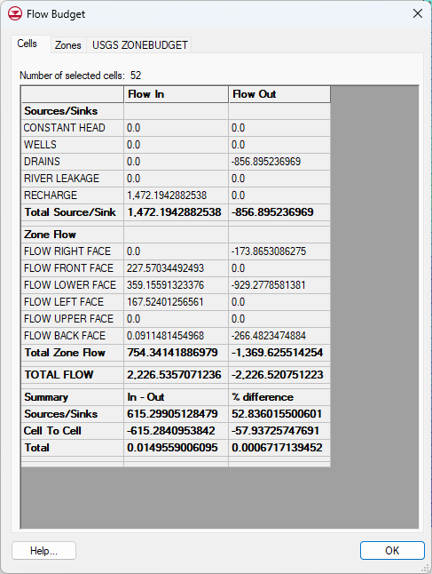{width="5.072282370953631in"
height="6.728325678040245in"}

Upward seepage is about 359 m^3^/d and infiltration to the lower
aquifers 929 m^3^/d.

-   Select the data sets of the CCF (Cell to Cell Flow) file:

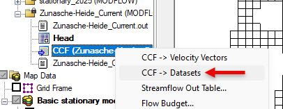{width="4.22863845144357in"
height="1.6352121609798775in"}

-   Select the "Flow Lower Face" (having layer 1 selected).

    -   Tweak the legend for a clearer view

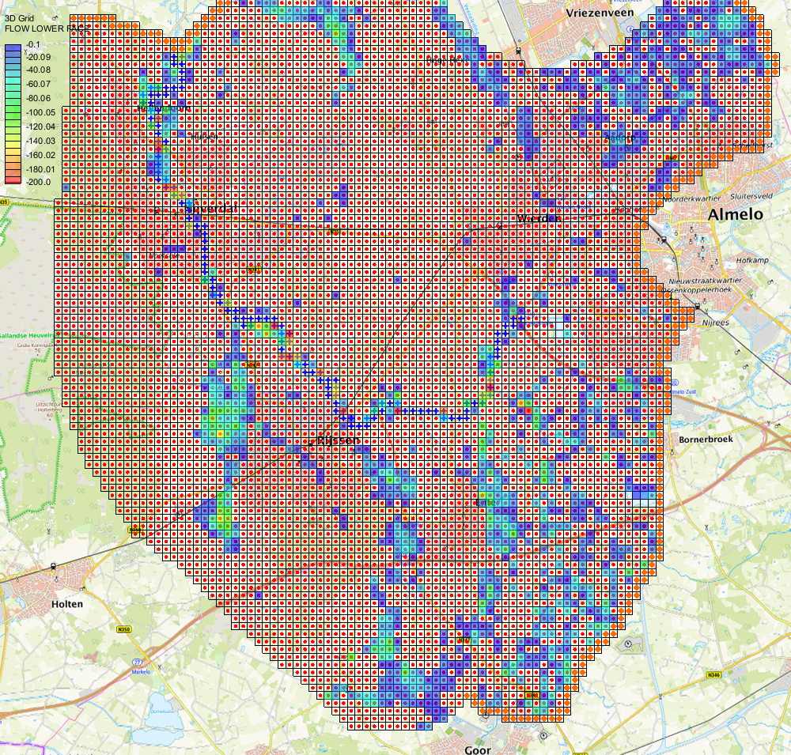{width="6.5in"
height="6.207638888888889in"}

In the image above, you clearly see that there is upward seepage in the
south-eastern part of the Zunasche Heide at this stage.

## 1.1 Creating a local model for the Zunasche Heide {#creating-a-local-model-for-the-zh}

1.  Run the regional/basic model to have the most recent (correct) heads
    determined

2.  Create a new coverage with CHD activated for all 5 layers.

{width="2.9980293088363954in"}

1.  Create a rectangular shape of about 1000 m(or some more) around the
    Zunasche Heide. It's more convenient to investigate all layers wrt
    their isohypses. Top layer is probably affected by
    top-systeems(drainage) and the Regge. Better to look at a lower one.
    Make sure that two boundaries reflect the isohypses at that
    location. The two other arc's should then be no-flow boundaries (aka
    Neumann). Flow vectors could be helpful here. Use the deepest heads
    since one wants to capture the regional flow pattern. But also check
    whether the other boundaries are more or less in line with the
    deepest layer. Three times $\lambda$ is not that necessary since we
    assume that our simulated flow is not that bad.

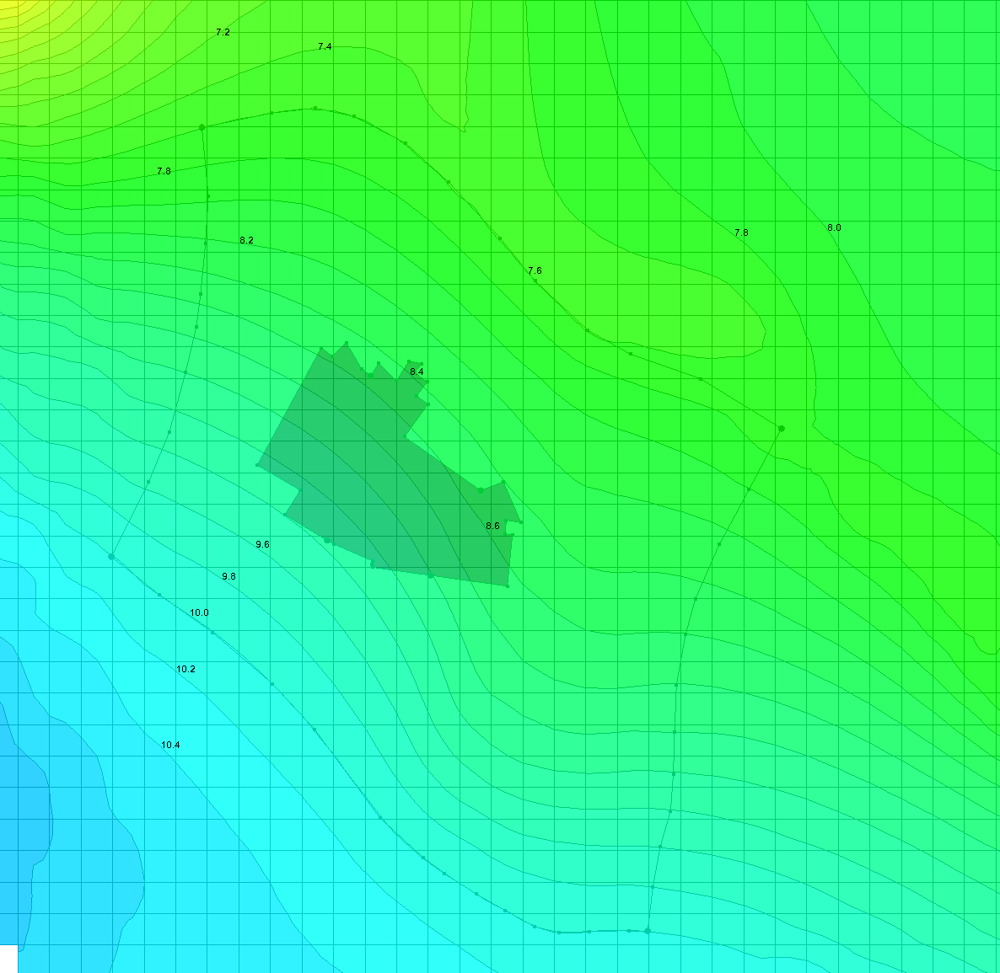{width="3.943659230096238in"
height="3.840433070866142in"}

## 1.2 Creating 2D scatterset of the regional model for interpolation {#creating-2d-scatterset-of-the-regional-model-for-interpolation}

A separate local model will be developed and therefore relevant data
from the regional model will be converted to 2D scatter sets.

These data will then be interpolated to the new (local) modflow model.

1.  Select 3D Grid Data and then open the Grid main menu

2.  From there select MODFLOW layers -\>2D Scatter Points..."

{width="3.1361504811898513in"
height="2.588992782152231in"}

Check the "layer elevations" and "Flow package properties" and computed,
stationary heads. Here, scatter data is created for the Zunasche Heide
local model only, upper checkmark..

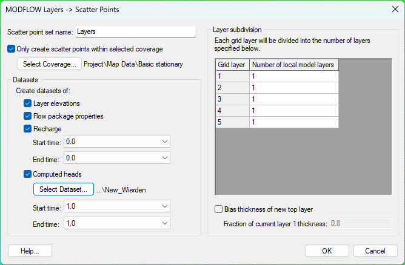{width="4.028924978127734in"
height="2.6420450568678917in"}

No need to use the Layer subdivision (previous window/clip).

This results in the following 2D scatter sets:

{width="6.5in"
height="4.670833333333333in"}

Set the Dirichlet boundary condition arc (CHD) to the proper values.
These boundaries should now be purple.

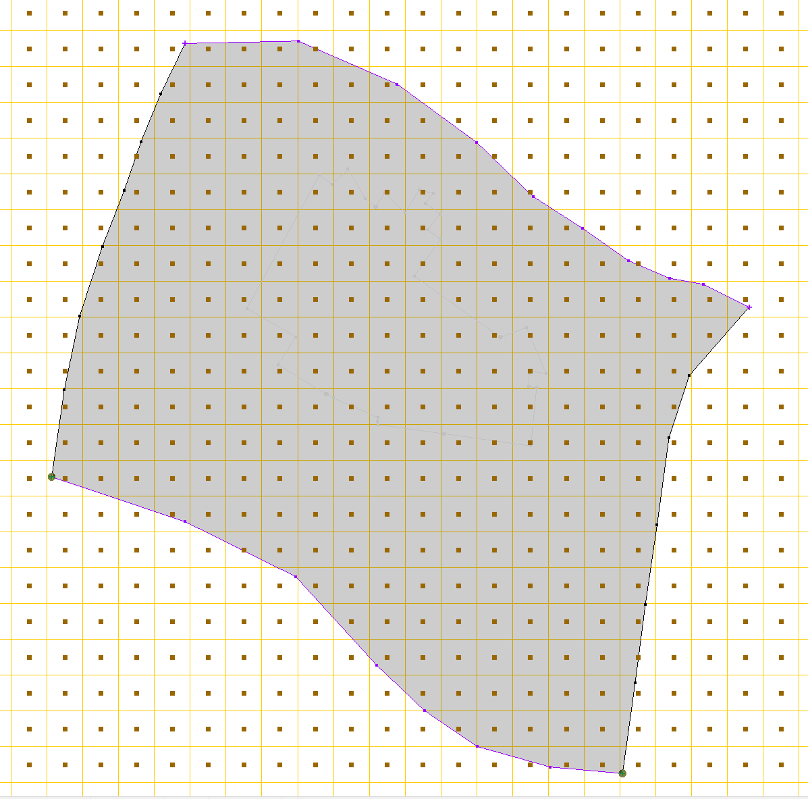{width="4.069353674540682in"
height="4.021965223097113in"}

The next step involves setting up the new local model for Zunasche
Heide.

Now it's a good time to rename (save as) the model with all the loaded
data to another name (ZH_local.gpr for example)

1.  Create a new 3D grid for the local model

{width="3.842169728783902in"
height="1.1966349518810149in"}

2.  Set the grid frame the active coverage

{width="3.332678258967629in"
height="2.3013385826771655in"}{width="3.336072834645669in"
height="2.8288899825021874in"}

2.  Create a 3D grid having a new cell size of 50 m and assign 5 layers
    to it

{width="3.340582895888014in"
height="1.4400918635170603in"}{width="4.04540791776028in"
height="3.069063867016623in"}

2.  Create a new simulation:

{width="3.4162390638670166in"
height="1.1144444444444443in"}

2.  Select the "Map data" and make sure that the coverage containing the
    proper local Dirichlet and Neumann boundary conditions is active{width="5.564354768153981in"
    height="4.336153762029746in"}{width="3.295197944006999in"
    height="2.8206332020997373in"}{width="3.966933508311461in"
    height="4.109335083114611in"}

3.  Probably safer to remove the coverage containing the boundary
    conditions of the regional model.

Before mapping the GMS coverages (landuse and drainage) the new model
need to have the proper layer elevations.

## 1.3 Interpolate 2D scatter data to the local model {#interpolate-2d-scatter-data-to-the-local-model}

1.  Select the Regional Wierden model Scatter data and select
    "Interpolate -\> MODFLOW Layers"{width="6.353372703412074in"
    height="2.593426290463692in"}

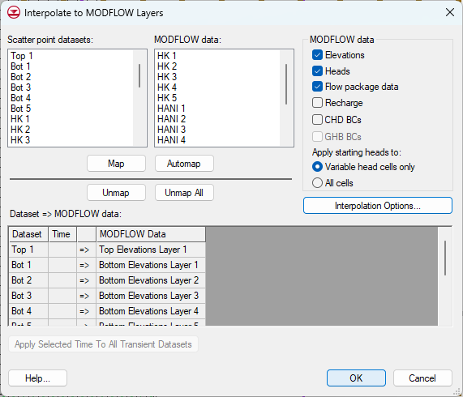{width="5.947173009623797in"
height="5.103529090113736in"}

One could set the Interpolation Options to simple Natural Neighbour.

Also check the RCH button above for convenience

## 1.4 Incorrect surface elevations!! [Is superseded now with New_Wierden.gpr {#incorrect-surface-elevations-is-superseded-now-with-new_wierden.gpr}]{style="color:red;"}

The top 1 of the the models is based on the Solids. This seems not to
align with the "Wierden_elevation.tif"

As a consequence calculation of water table depth w.r.t. surface is not
correct!

Noticeable is the many locations where, at first, heads above surface
seems reasonable, they are however not.

Alternative 1

1.  Make sure the have 2D grids already present in the Explorer window

2.  Interpolate the "Wierden_elevation.tif" to 2D grid

3.  In 3D top double click on this and assign the grid to the top layere

Alternative 2 (quicker?)

1.  Interpolate "Wierden_elevation.tif" to MODFLOW layers...

{width="4.473004155730534in"}

1.  Assign it to Top1 layer

{width="4.699246500437446in"}

## 1.5 Map the appropriate GMS-coverages to the local model {#map-the-appropriate-gms-coverages-to-the-local-model}

4.  Map all appropriate GMS coverages (landuse/drainage) to the new
    model (*just to be sure that stuff is not missed. But since the
    drainage elevations are all based on Wierden_elevations minus 40, 80
    or 100 cm, this should not affect the head calculatons drastically)*

{width="4.677155511811024in"}

4.  Save the data to the current model

5.  Check the new model for errors/mishaps

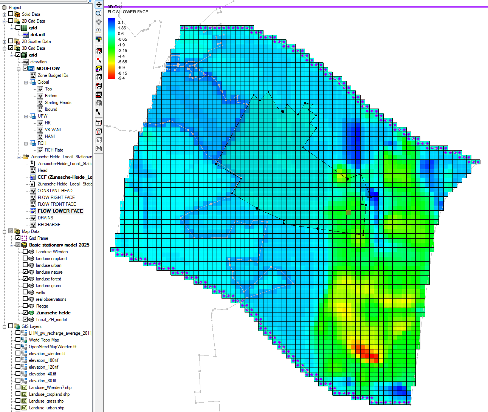{width="4.5279604111986in"
height="3.833286307961505in"}

## 1.6 Calculate the depth of the water table {#calculate-the-depth-of-the-water-table}

1.  Convert 3D grid model data to 2D grid for some manipulations

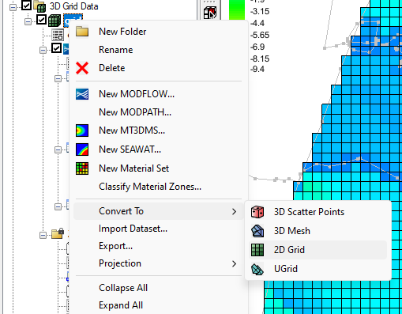{width="3.5101990376202976in"
height="2.7378160542432197in"}

2.  Select grid data to calculate the water depth wrt surface

{width="3.0352384076990377in"
height="3.2955971128608925in"}{width="3.3329166666666667in"
height="1.7914424759405074in"}{width="2.9579636920384953in"
height="1.3956583552055992in"}

3.  Same thing with the head of the first layer

4.  Subtract them{width="6.5in"
    height="7.74375in"}

> Same plot with interval 20 cm and Zunasche Heide indicated.
>
> 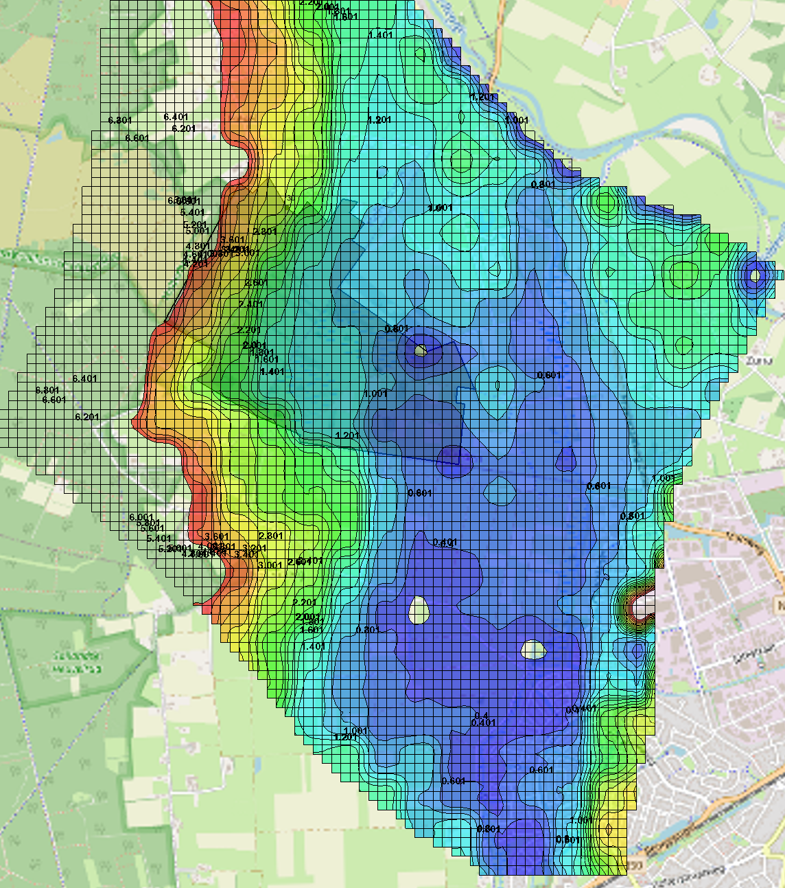{width="6.5in"
> height="7.346527777777778in"}
>
> Currently the plot indicates that gwt is at about 80 -- 100 cm below
> surface in the southeastern part. Towards the north east gwt's are
> increasing from 120cm till about 400cm below surface.

The water budget now; left flow budget of Zunasche Heide in the local
model right the one in the regional (new)Wierden model

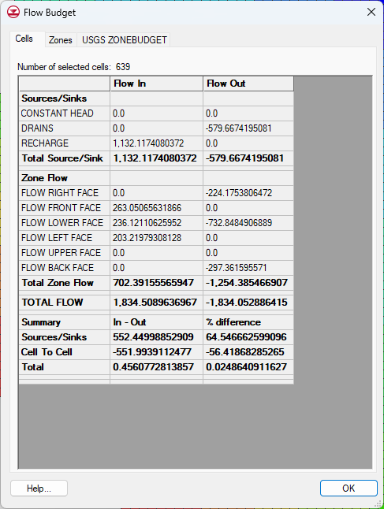{width="2.619659886264217in"
height="3.4749496937882767in"}{width="2.5756244531933508in"
height="3.4165365266841645in"}

Deviations are not that small. Since the local model has way more cell
rounding around the perimeter of Zunasche Heide could play a role?
Moreover, the scatterset comes from a grid 4x coarser, so interpolation
could may be also play a considerable role here.

Looking at drainage locations, it seems to be in reasonable agreement
with eachother (Drainage flux DRN):

{width="2.9054451006124236in"
height="3.56258530183727in"}{width="2.9624289151356082in"
height="2.713027121609799in"}

Below the calculated upward seepage: flux lower face/(50\*50)\*1000

This local model is called "**ZH_local.gpr**"

## 1.7 Removing the top soil (40 cm) {#removing-the-top-soil-40-cm}

1.  Load "elevation_wierden_zh_40.tif"

2.  Right click and select 

3.  Double click on the "Top" of the modflow layers (in the explorer
    window: 3D grid data\|Grid\|MODFLOW\|Global\|Tops). The Top
    elevation grid display appears and select "2D Dataset -\> Layer..."
    and then the 2D grid elevations based on the tif file.

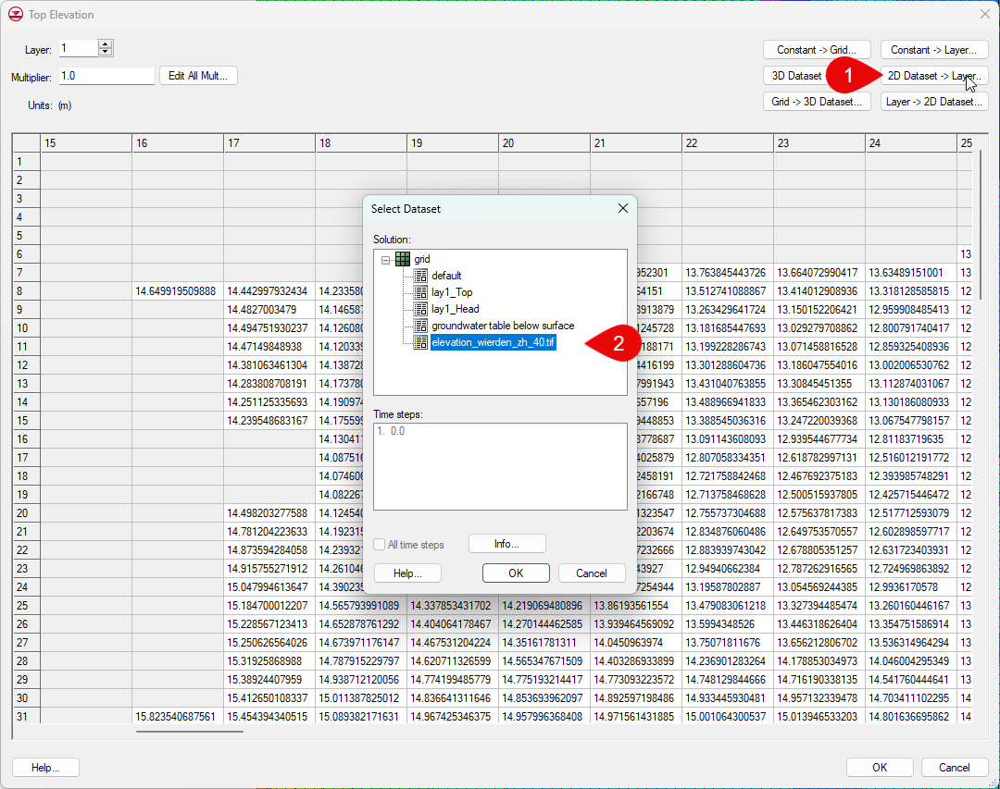{width="600"}

4.  Save this model. You may consider saving this with a new file name.

5.  Rerun the model and calculate the groundwater table depth see
    section 1.6

This procedure results in the required groundwater table below surface
with the topsoil removed:

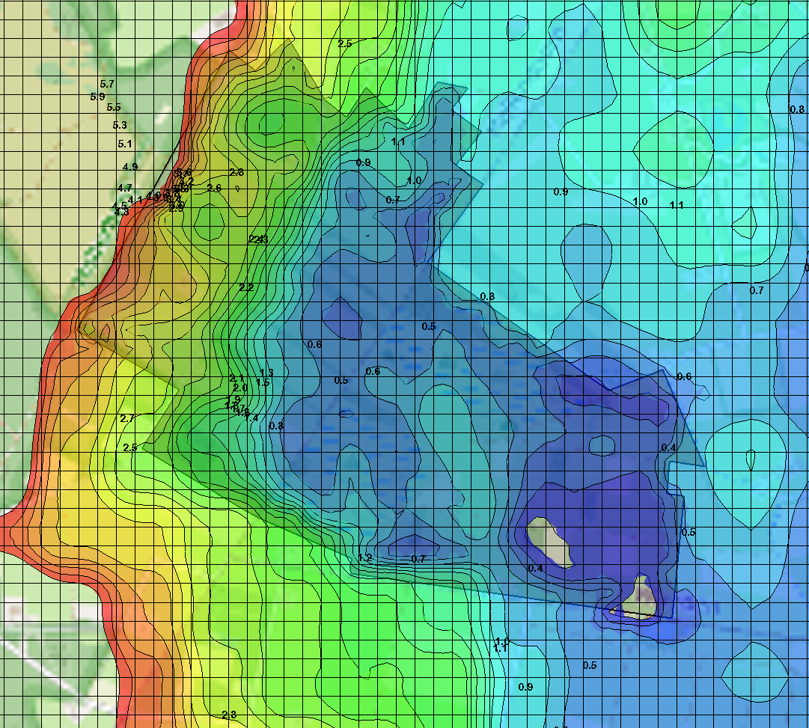{width="6.5in"
height="5.850694444444445in"}

Compared to the original surface elevation the groundwater table now
clearly is much higher. In de south eastern part the table even rises
above the surface at a few nodes. Elevations there, are in the order of
40 -- 60 cm below surface. Note that this is based on removing the
topsoil only.

This model is called "**ZH_local_no_topsoil.gpr**"

### 1.7.1 Adjusted landuse_grass shape file {#adjusted-landuse_grass-shape-file}

Since all drainage coverages need to be mapped (to MODFLOW) in one go,
the landuse_grass shape file is adjusted, omitting the Zunasche Heide as
grassland . This has been accomplished with the new shape file
"landuse_grass_without_Zunasche_heide.shp" (incl. the accompanying
files).

1.  Load "landuse_grass_without_Zunasche_heide.shp[^1]" into GMS

2.  Create a new (for safety) GMS coverage to map landuse grass (now
    thus without Zunasche Heide) and check Layer range, DRN, and Auto
    assign to one layer

3.  Right click on the landuse_grass_without_Zunasche_heide.shp and
    "convert to feature objects". Zunasche Heide is now removed as grass
    landuse{width="4.787237532808399in"
    height="3.574255249343832in"}

4.  Set up the new grass coverage with the proper resistance and drain
    stage;

[^1]: The accompanying \*.dbf, prj and shx files are loaded
    automatically. Be sure to have them located at the shp file

{width="6.5in"}

## 1.8 Setting the drain stage in Zunasche Heide to surface elevation {#setting-the-drain-stage-in-zh-to-surface-elevation}

Originally the drain stage for the Zunasche Heide and surrounding area
(non -nature) was mostly 80 cm below surface.

Now we are going to set the drain stage for Zunasche Heide to new
surface elevation, being 40 cm lower.

Another aspect for the drainage situation in Zunasche Heide is that, in
reality ditches and tile drainage are removed to rise the groundwater
table. Here we are not going to simulate local drainage instances
because that's for now way to much work.

As an alternative we estimate a drainage resistance of 50 days. Since
there are no water courses in the area, water will only encounter
vertical resistance through the topsoil. +/- thickness for water to
travel vertically through the soil to the surface 1.50 m (crude guess)
$C = \frac{d}{K} \rightarrow K = Cd = 50*1.50 = \ 0.03\frac{m}{d}$ which
seems reasonable to me

1.  Check that the Zunasche Heide coverage setup is set for "layer
    range" and "drain" and set Auto Assign layer to "..one cell" the
    upper one.

2.  Assign 1/50 = 0.02 m2/d/m2 and raster "elevation_wierden_zh_40.tif"

3.  Map all drainage (optionally also the boundary conditions again) to
    the model

4.  Run the model and again analyse the groundwater table and flow
    budgets

5.  This model is called: "**ZH_local_DRN_surface.gpr**"

## 1.9 Some results {#some-results}

### 1.9.1 Groundwater table wrt surface {#groundwater-table-wrt-surface}

Two situations, left based on the current situation with drainage stage
at surface and a resistance of 50 days and right the original grassland
drainage (stage -80cm and C=150d)

{width="3.2296194225721786in"
height="3.136803368328959in"} {width="3.261963035870516in"
height="3.543898731408574in"}

Below a plot of the difference between the groundwater table with only a
removed topsoil and the groundwater table based on a new drainage system
in the Zunasche Heide with a drain stage at surface elevation (which is
elvation_wierden_zh_40) and a drainage resistance of only 50 days
mimicking the reduction/removement of the local drainage system.

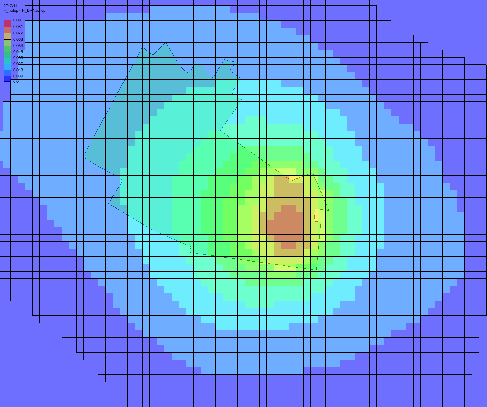{width="4.654014654418198in"
height="3.8872954943132108in"}

One can clearly see that the groundwater table has risen in the Zunasche
Heide, particularly in the south-eastern part, to about 9 cm.

### 1.9.2 Flow budgets {#flow-budgets}

The new situation with the elevated drain stage at surface, causes DRN
flux to reduce drastically, which is logical since the drain stage is
now too high for the water to be discharged through the drainage system.

{width="3.002029746281715in"
height="4.171362642169729in"} {width="3.0012817147856516in"
height="4.179734251968504in"}

The flux rate coming from the 2^nd^ layer to the top shows a similar
pattern;

{width="3.006272965879265in"
height="4.190287620297463in"} {width="2.914669728783902in"
height="4.031024715660543in"}

Flow budget for both situations for the Zunasche Heide;

{width="2.32661198600175in"
height="3.08622375328084in"} {width="2.3297364391951008in"
height="3.090369641294838in"}

## 1.10 Rising the drain stages in the surrounding area {#rising-the-drain-stages-in-the-surrounding-area}

While the groundwater table rose with the measure to reduce drainage in
the Zunasche Heide by rising the drain stage to the surface, upward
seepage declined to 52 m^3^/d and was 236 m^3^/d= 78%.

To mitigate this effect, another measure needs to be taken to increase
the amount of upward seepage in the Zunasche Heide again.

The proposed approach is to also raise the drain stage to 50cm below the
surface of the surrounding grasslands (was 80 cm below surface).

*Created a new raster based on AHN3 and resampled to 50x50. On average
this set is pretty much higher, and different compared to
"Wierden_elevation". This could be that 50x50 indeed gives different
results than 100x100 (Wierden_elevation) at bigger slopes, which you can
see on the ice pushed ridges but also in the relative flat area of the
ZH region...*

*In addition, at locations where there is "no-data" at a few (3) grid
cells an error occurred mentioning*

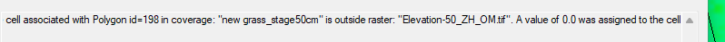{width="6.5in"
height="0.38263888888888886in"}

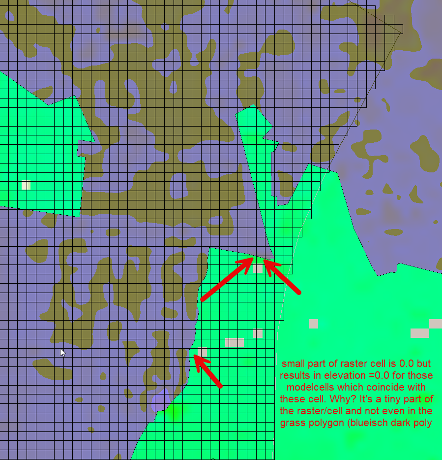{width="2.8802712160979875in"
height="2.9922812773403327in"}

*Chosen now for creating a new raster based on "Wierden_elevation" and
subtracted 50 cm :" elevation_50cm.tif". So a 100x100 m grid resolution*

## 1.11 Some results {#some-results-1}

### 1.11.1 Groundwater table wrt surface {#groundwater-table-wrt-surface-1}

{width="3.1370953630796152in"
height="3.39248687664042in"} {width="3.2296194225721786in"
height="3.136803368328959in"}

The groundwater raised more than with only ZH_DRN-stage at surface and C
= 50 d

The effect of raising the grass drain stage is shown in the plot below
and is calculated as

Grw_table_ZH_DRN_stage_at_surface_Grass_DRN_stage_at_50 -
Grw_table_ZH_DRN_stage_at_surface.

Note that values are all negative. So the groundwater table depth wrt
the surface is deeper in case of Grw_table_ZH_DRN_stage_at_surface,
meaning a [larger]{.underline} value

In other words, the
"Grw_table_ZH_DRN_stage_at_surface_Grass_DRN_stage_at_50"
data/groundwater table is more shallow, thus smaller numbers.

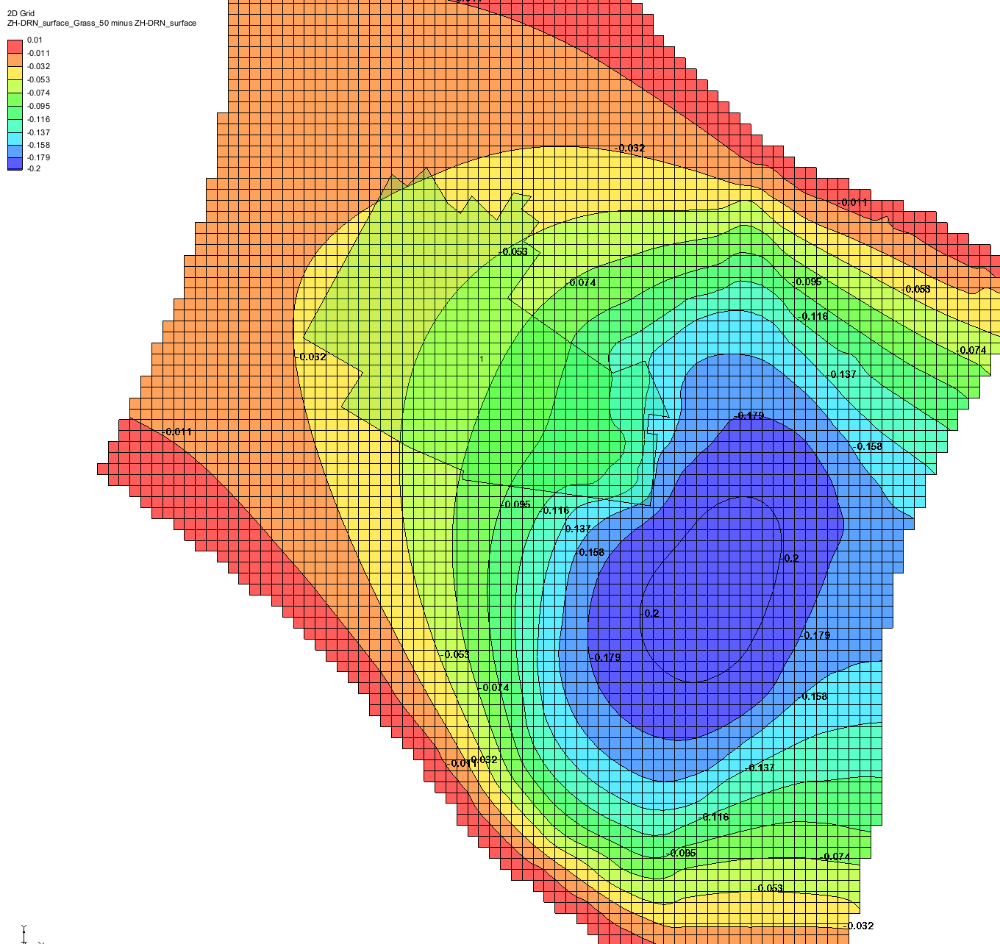{width="6.5in"
height="6.136805555555555in"}

A cross sectional view for the current situation. Blue line indicates
the groundwater table

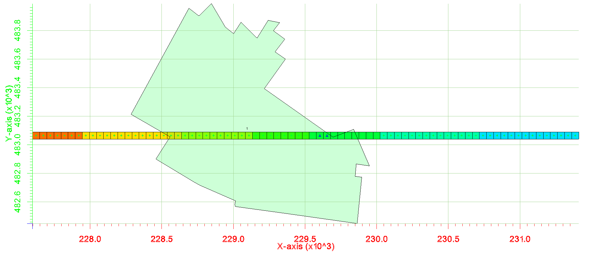{width="2.2540343394575677in"
height="0.9781933508311461in"}

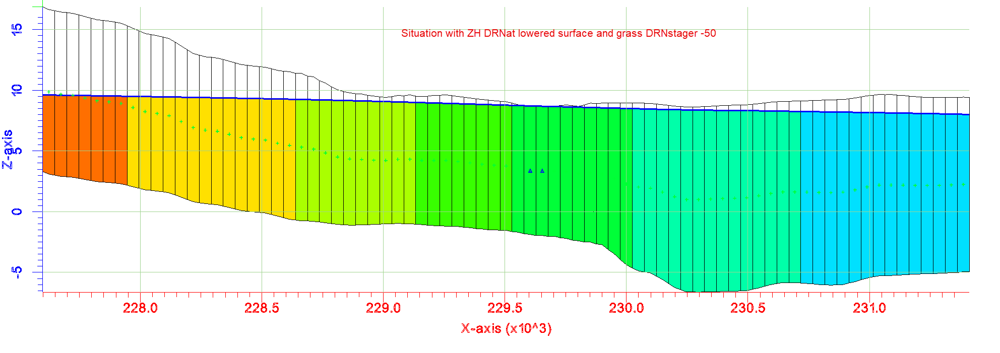{width="6.5in"
height="2.296527777777778in"}

### 1.11.2 Flow budgets {#flow-budgets-1}

As shown in the plot below, upward seepage is increased in the Zunasche
Heide area, although not that much that it fully compensates the raise
of the drainstage at the surface in Zunasche Heide

{width="2.6650951443569553in"
height="3.0665682414698163in"} {width="2.464679571303587in"
height="3.4086832895888013in"}

{width="2.5629943132108486in"
height="3.399783464566929in"} {width="2.5983398950131233in"
height="3.4466688538932635in"}

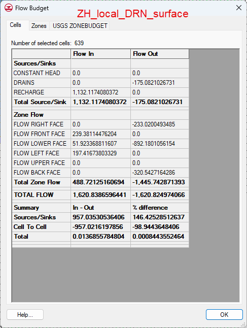{width="3.3000229658792652in"
height="4.377444225721785in"}

# 2 Required data

The base Wierden model

### Raster data:

**Wierden_elevation.tif**

> ~~*Raster with surface elevation of the whole region. It is required
> to remap the top elevation of the model since elevation coming from
> the Solids is not correct. See section 1.4 for further details.*~~
>
> When using the [new solids]{.underline} this step becomes obsolete.

**Elevation_50cm.tif**

> *Raster with a DRN stage at 50cm below surface. Needed to adjust DRN
> to 50cm for the surrounding grass lands*

**Elevation_wierden_zh_40.tif**

*A raster with the surface elevation of the whole region with lowered
elevations (40cm) in the Zunasche Heide.*

### Vector (shape) data

**Landuse_grass_without_Zunasche_heide.shp** (+dbf,shx,prj,cpg..)

*Shape file without the Zunasche heide.*

**Zunasche heide.shp** (+dbf,shx,prj,cpg..)

*Shape file containing one polygon for the Zunasche heide area. Can be
used for assigning a new drain stage at the surface (which is similar to
"elevation_40.tif")*
