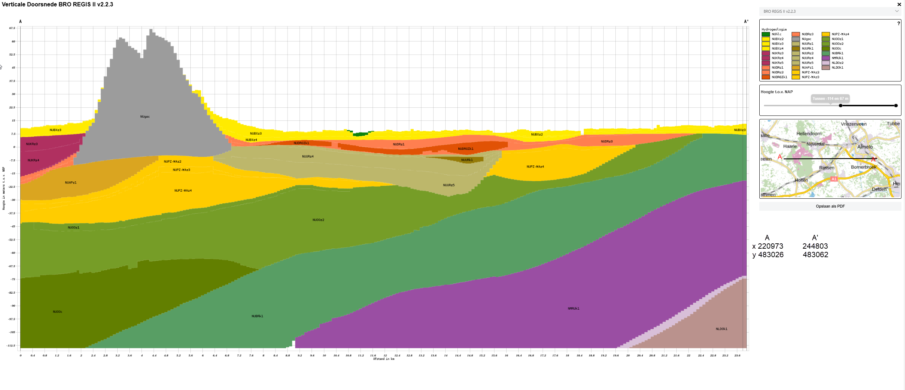
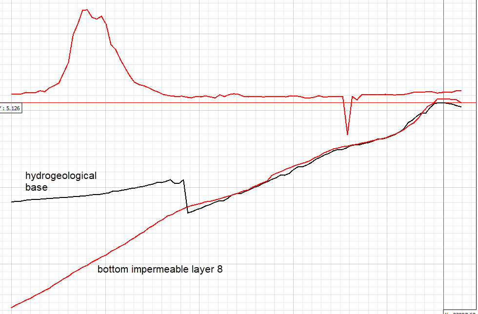
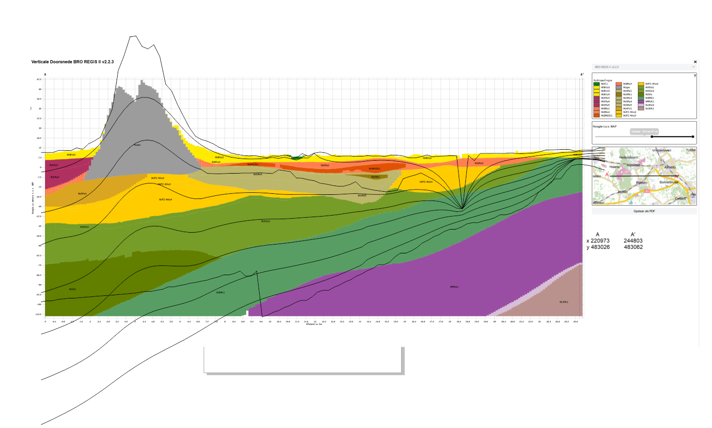
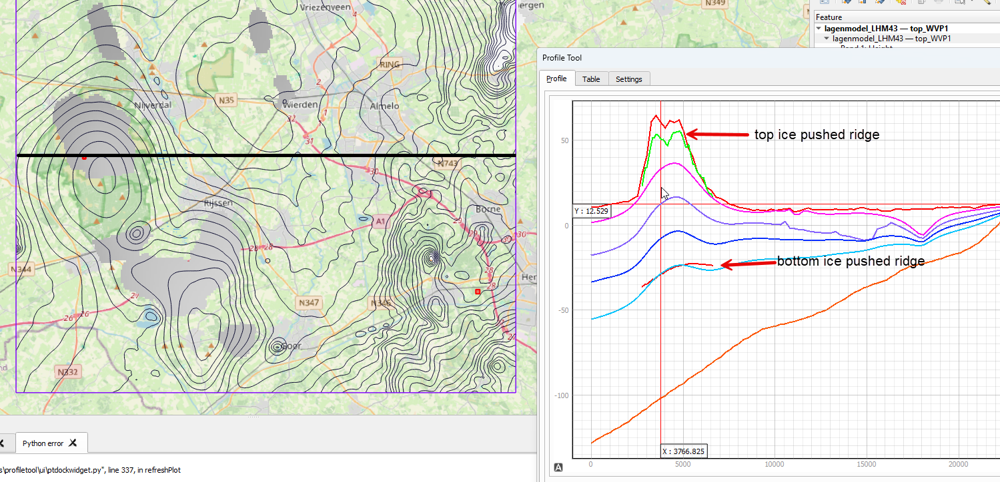

# Introduction

To set up the modflow models in the Wierden area, different types of
data are required:

1.  Elevations of the different formations

2.  Hydraulic properties of the different formations

3.  Water management of the area

    1.  Diffuse drainage resistances (expressed as conductances).

    2.  Drain stages related to land-use types

4.  Open water

5.  Recharge stationary and transient

6.  Boundary conditions at the perimeter of the models domain

Steps 3 until 7 will be described in other documents.

Here the focus will be on the elevation of the different formation
layers and the hydraulic properties (HK, HV or ratio) of these
(combined) formations.

These data are based on LHM (Landelijk Hydrologisch Model) version 4.3.
maintained at [web page LHM
data](https://nhi.nu/modellen/lhm/ "url LHM") .

## Elevations of the different formations

With the help of [sub soil models region
Wierden](https://www.broloket.nl/ondergrondmodellen/kaart "BRO models")
the following cross section was created:

As shown in 'grey' the ice pushed ridge is described being a "gestuwde
afzettingen, complexe eenheid". No hydraulic conductivity or resistance
is assigned to this formation.

To get proper elevations from LHM data is a bit tricky!

There are 8 layers in the LHM model .

The layers are defined with top_elevations and bottom_elevations.

[Top elevations are:]{.underline}

"top_impermeable_layer1",

"top_impermeable_layer2",

"top_impermeable_layer3"

till "top_impermeable_layer8"

[Bottom elevations are:]{.underline}

"base_impermeable_layer1",

"base_impermeable_layer2",

"base_impermeable_layer3",

till "base_impermeable_layer8"

One would expect that the top of impermeable layer 2 coincides with the
bottom of impermeable layer 1. This is in good agreement most of the
time. Some deviations were noticed. Top 3 vs base 2 do differ in the
middle somewhat about 3 to 5 m over a short range.

Most striking is the difference between "base_impermeable_layer8" and
"geohydrological base". Not the clip below:

I have no idea why this is!

Also tried to overlay the cross-section of the elevations (Qgis) with
the formations from REGIS 2.3, see the clip below

Now considering another approach.

### Complex gestuwde formatie becomes formation with low K's

-   Through the LHM data site; <https://data.nhi.nu/bekijk> downloaded
    the following sets:\
    horizontale_anisotropie_top.nc

-   horizontale_anisotropie_bot.nc

With this the ice pushed ridges can be simulated with relative low
conductivities mimicken the anisotropical nature of the tilted
formations. How derive a proper K is not that easy since the formations
are not only clayey deposits.

With knowing the position and depth of the ridges we can now determine
three formations to model within modflow using the following elevation
data sets:

1.  surface elevations -\> "Lagenmodel_LHM43-top_impermeable_layer_1"

2.  top_ridges -\> "horizontale_anisotropie_top"

3.  bot_ridges -\> "horizontale_anisotropie_bot"

4.  hydrogeological base -\> "Lagenmodel_LHM43_base_impermeable_layer_8

The elevation of the hydrogeological base nicely aligns with the top of
the Breda formations which are clay deposits.

See the following clip:

As shown in the above clip, the ridges are only very locally present.

### Building model layers

**MODFLOW-NWT, 2005**

This means that for models based on modflow nwt or 2005 that model
layers are continous in the whole domain. Basically in the domain all
model layers will be present.

Now still two options for layers where the ridges are not present;

1.  thin layers, pinching out till the perimeter

2.  evenly distributed thicknesses of the layers (standard option used
    till now)

option 1 can give problems being too thin but also issues can arise
dry-wet issues. For example too thin layers where RCH need to be
extracted can result in problems drying out all cells at that point.

option 2 is most rubost but miss partly ridges when the center of a
model not coincides with the ridge.

#### Creating solids

To create new solids for the creation of mf-nwt models the following
recipe could work

Required are all elevations; surface, top-ridge, bot-ridge,
geohydrological-base

1.  Create a TIN

    1.  new coverage, large polygon extending the surface_elevation.tif
        but keep in within avoiding interpolation issues later on

    2.  set vertices on the polygon arc to 100 m

    3.  create the TIN by following the steps in the clip: 

    4.  Map the elevations (i.e. the raster files ) to the individual
        TINs

    5.  Make sure that the numbering of the TIN's (mandatory) counts
        from bottom to top. So geohydrological base receives TIN number
        1:{width="200"}

    6.  The next TIN is not the bottom of the ice pushed ridges which is
        only partly present. TIN nr. 2. The distribution can be seen in
        "bot_ridges.tif"):

    7.  The top of the ice pushed ridges ("top_ridges.tif")

    8.  The upper TIN is nr. 4 and is based on "surface_elevation.tif"

    9.  Create solids from these TIN (horizons):

    10. Define the top and bottom TIN elevation for the solids:

    11. The following choices were used: Natural neigbor with
        constant nodal function to avoid strange elevations. "Intersect
        horizon surfaces" according to the Help; "Allows the solids to
        intersect with horizon surfaces". In this case hardly noticeable
        differences.

    12. The solids 3 in this case should appear:

    13. As an alternative I tried to use the "top_imp_layer_5.tif" which
        coincides with the bottom of the ice pushed ridges. With this
        the idea is that one distinguishes the upper 4 and lower 4
        layers of LHM4.3. This resulted in the following solids:

        Now the ice-pushed ridge formation is extended way too much.

#### Creating solids with (dummy) boreholes and cross-sections

To improve the solids which should include the ice pushed ridges but not
extended in the whole domain **and** distinguishing the upper and lower
at the "top_impermeable_layer_5" which coincides the bottom of the ice
pushed ridge, boreholes created in QGIS(3,40) were created and exported
to a csv file. Two different sets were created in QGIS and with an R
script rewritten to the GMS boreholes format:

1.  borehole.txt

2.  borehole_ice_ridges.txt

Both borehole files we loaded into GMS (as "borehole data). Next step is
to "auto-create blank cross sections" and from that "auto-fill cross
sections" :

This take quite a while to build but finally the following result
appears;

Now boreholes and cross-sections are available as well, the new solids
based on:

-   TIN's

    -   surface

    -   top ridge

    -   bot ridge

    -   top imp_lyr5

    -   base

-   Boreholes and cross-sections auto-created and auto-filled

Although the ice pushed ridges (red) seem to do OK now, it's clearly
visible that the upper aquifer is way too thin and the lower one almost
the total thickness

So, it's still quite tricky to create solids showing local ice pushed
ridges AND a reasonable distribution of the upper and lower aquifer.

Again having a closer look at the cross sections and reconsidering the
order of formations, the current set looks like the following. This case
not snapped to the surface elevations but that will take place during
the solid creation.

What seems to work best now (d.d. 9-12-25) is the following:

1.  Select boreholes to create solids from there:{width="180"}

2.  Now, [only]{.underline} select the boreholes and cross-section data
    to create the horizon solids:{width="350"}

3.  Use the surface TIN as reference TIN and for the top elevation of
    the solids. For the bottom elevations of the solids the boreholes
    and cross-sections are used:

4.  The last step selects the interpolation method, no minimal
    thickness:

These steps and data finally results a reasonable and better set of
solids compared to the first sets of about 2014-2015.

**MODFLOW 6**

Since modflow 6 is based on UGRIDs, it is not required to have model
layers continuous in the model domain.

## Hydraulic properties of the different formations

The Holterberg is a dominant (hydro)geological feature in the Wierden
area. This ice pushed ridge and other hillish-elevated areas, originates
from the "Saalien" iceage about 150.000-200.000 yeas ago.

During that time, land ice coming from Scandinavia pushed forward the
formations which were deposited earlier. These mainly contain sandy,
gravely and clayey deposits. As a consequence, these formations were
pushed forward and sideways, resulting in tilted formations. The tilted
clayey formation within the ice pushed ridge result in **anisotropical**
properties, which means that groundwater flow will encounter different
hydraulic conductivities based on the direction of the formation of
these ice pusched ridges.

As a consequence, the Holterberg and ridges south-eastern from the
Holterberg need anisotropical parameters for the model layers where they
reside.

For the usual set up of a groundwater model in the Wierden we will
simply the effect of anisotropical features to a simple resistance or
better a relatively low hydraulic conductivity of **0.5 m/d.**

The upper aquifer (red in the upper clip) is based on the upper 4 LHM4.3
layers. The lower aquifer for the other 4 layers of LHM4.3:

|             |                  |                      |
|-------------|------------------|----------------------|
| **Aquifer** | **K_mean (m/d)** | **K_std. dev (m/d)** |
| upper       | 26.4             | 13.23                |
| lower       | 16.54            | 17.14                |

: Hydraulic Conductivity aquifers

## Water management of the area

In the Wierden area many land use type can be distinguished. The
following map illustrates the different type based on LGN24:

Based on this map and using some GIS tricks (I think I used disolved and
other tools) these different land use type were aggregated to only the
five given in the table below. This table includes the related
watermanagement properties.

| Landuse type    | Drainage resistance (days) | Drain stage (cm. below surface) |
|-----------------|----------------------------|---------------------------------|
| Grasslands      | 150                        | 80                              |
| Cropland        | 250                        | 100                             |
| Urban area      | 600                        | 120                             |
| Forest          | 1000                       | 80                              |
| Nature reserves | 50                         | 40(wet) 80(dry)                 |

: water management data

The abovementioned aggregates land use type in the Wierden region are
illustrated in the following clip. These can be loaded into GMS as
polygons

For implementing these land use types, the following shape files (+
accompanying files) are available:

| Aggregates land use coverages |
|-------------------------------|
| Landuse_grass.shp             |
| Landuse_heath_nature.shp      |
| Landuse_forest.shp            |
| Landuse_urban.shp             |
| Landuse_cropland.shp          |

: Landuse coverages

## Open Water

Few open water courses are present in the Wierden region. The main
purposes are discharging, nature conservation (re-meandering, fish
stairs), and tourism. The main and most dominant course is the Regge,
followed by the Eksosche Aa and the Doorbraak (since 2009, and only used
in an AHSA-project).

The hydraulic properties for the Regge and Eksosche Aa are already
packaged into the "Regge.shp" (+ accompanying files) file containing

-   course of the open water reaches

-   bottom width, side slope, bed slope

-   river bed resistances, translated into conductances

-   several weirs having prescribed upper and lower weir/water levels

These data comes from the water board of "Vechtstromen" ; and is
recorded in the "legger"/register which can be found by this url:
[Legger (register) of waterboard
Vechtstromen](https://vechtstromen.maps.arcgis.com/apps/webappviewer/index.html?id=4e12f4b0cb544e9db01343a890e6e54f).
The clip below illustrates the use of the (digital) legger:

## Recharge stationary and transient

Different approaches can be used to calculate the recharge rate entering
the subsoil. One of the simplest is calculating the Potential
evapotranspiration $E_{pot}$ by: $E_{pot}=E_{ref}*f_{crop}$. Where
$E_{ref}$ is the Reference evapotranspiration which comes from a
meteorological station (Twenthe; [weather data from
Twenthe](https://www.knmi.nl/klimaat-viewer/grafieken-tabellen/klimaattabellen-per-station/twenthe/klimaattabel_twente_1991-2020)
) and $f_{crop}$ stands for crop factors and depends obviously on the
land use type (and season). The daily precipitation and reference
evapotranspiration of this station can directly downloaded from this
url: [link to daily meteo
data](https://daggegevens.knmi.nl/klimatologie/daggegevens)

A more advanced procedure is used in LHM4.3 in which the METASWAP
component calculates the actual recharge depending on soil properties,
groundwater table depth, moisture content/pressure head and land use.
This is readily available for use and can be imported as a raster file:
"LHM_stationary_recharge_m_d.tif"

Although the different soil types are not included in the distribution
of the different recharge types the LHM_recharge rates reasonably
overlap the land use coverages.

Using the transient recharge time series of LHM4.3 is not feasible for
this course because this includes very large data sets of time series
(in NC format) for each pixel in the domain. In addition, these pixel
cannot be assigned to land use type only since the soil properties also
play an important role in calculating the recharge.

For the transient recharge, three different recharge time series were
calculated based on an R-script containing soil properties for the
unsaturated and saturated zone, time series for precipitation and
reference evapotranspiration. At three locations in an imaginary
cross-section from the Holterberg towards the Regge, flow was calculated
in the unsaturated zone (Richards) and saturated zone (Darcy). The
following clip illustrates this model:

The net result used in this course is the recharge for higher regions
(forest), shallow regions (grass) and recharge for urbanized areas.
Since the output also consists of time series of moisture contents in
each profile, the average storage coefficient (specific yield, $S_y$)
can also be determined. For this, the saturated moisture content is
subtracted from the current mean moisture content of the whole
unsaturated zone; $S_y(t)=\theta_{sat}-\frac{1}{Z}\int\theta(t) dz$

To distinguish higher and lower zones, a more or less arbitrary
groundwater table is chosen of 4.0 m below surface.

The simulated and aggregate 10-daily recharge for the different zone is
shown in the following clip of time series.

These time series were simulated with a really old set of R-scripts
making use of the very first versions of the FVFE1D package, which was
not even a package then.

The R-scripts are:

-   general_cross_section.R

-   sat_cross_section.R

-   unsat_cross_section.R

-   flow1D_16_10_12.R (the predecessor of FVFE1D package)

To avoid cumbersome reprogramming of these R codes, the scripts are
adjusted for the minimum. Only the meteorological data is adjusted to
recent time series and the time step is set to 1 day instead of 1/2 day.

Moreover another version of general_cross_section.R exists which
calculates the storage coefficients based on
$S_y(t)=\theta_{sat}-\frac{1}{Z}\int\theta(t) dz$ for each time step.

This is not included in the used general_cross_section.R. However, these
coefficients, on average, will not change that much based on the meteo
data of 1985-1995. Therefor the "S-data.csv" will still be used for the
practical to simulate transient conditions. The clip below illustrates
these storage coefficient time serie of the three unsat zones in the
transect.

With:

| statistic          | shallow    | medium     | deep       |
|--------------------|------------|------------|------------|
| Average            | 0.06409424 | 0.03894879 | 0.23819330 |
| Standard deviation | 0.00592662 | 0.02467677 | 0.0111490  |

: Average and standard deviation Sy per zone

Be aware that in GMS the Sy data requires a GMS-coverage for Sy only but
for all layers and that the Recharge requires a seperate coverage for
only the upper layer.

Moreover, if a warning appears (after mapping Sy and Recharge) that Sy
and Ss are 0.0 for the materials (the formation), the "use data arrays"
should be checked instead of the material ID in the UPW setup.

The Ss could be set to e.g. 0.001 for all cells.

### Pitfalls switching to transient

Be aware that the simulation is transient now, meaning that:

-   stationary observations (heads) should be removed from modflow

-   starting heads should be set to the stationary heads
