# Background info REGISII -\> LHM4.3

To me it's a hard time to reveal the procedure, in general terms, how
certain REGISII formation are transferred/allocated to the different
LHM4.3 model layers.

Moreover, most, if not all, documentation reports of the more recent LHM
versions describe **CHANGES** to LHM only but never [how]{.underline} it
finally looks like.

In addition, I still have my doubts whether LHM4.x contains 8 model
layers or 8 aquifer layers with 7 aquitard layers in between.

So I prompted ChatGPT for this (in Dutch)

*is er een samenvatting te vinden van de lagenopbouw die in LHM
(Landelijk Hydrologisch Model) versie 4.X is gebruikt? Er wordt genoemd
dat deze versie 8 "lagen" heeft maar zijn dat werkelijk 8 modellagen of
zijn dit 8 aquifer/watervoerende pakket lagen en zitten er dus ook nog 7
'weerstandslagen" tussen*

Its response:

------------------------------------------------------------------------

*Kort antwoord eerst: de “8 lagen” in LHM (v4.x) zijn verticaal
gestructureerde modellagen — dus echte modellagen in de
MODFLOW/MetaSWAP-schematisatie — en niet 8 alleen aquifer-pakketten met
daarachter telkens 7 expliciete klei/weerstandslagen. Niet-doorlatende
of slecht-doorlatende lagen (aquitards / scheidende lagen) worden in LHM
meestal niet als aparte expliciete lagen gemodelleerd maar als
weerstand(s) tussen lagen (of zijn geaggregeerd / weggelaten als ze
lokaal onbelangrijk zijn).
([STOWA](https://www.stowa.nl/deltafacts/zoetwatervoorziening/aanpassen-aan-klimaatverandering/inzetbaarheid-van-bestaande-hydrologische-modellen-voor-waterkwantiteit?utm_source=chatgpt.com "Inzetbaarheid van bestaande hydrologische modellen voor ..."))*

*Uitleg in iets meer detail (kort & praktisch)*

*In de LHM-opzet is Nederland ruimtelijk op 250×250 m gezet en verticaal
opgesplitst in 8 modellagen die gebruikt worden door het gekoppelde
MODFLOW (verzadigde zone) en MetaSWAP
(onverzadigde/bodemcompartimenten). Dit is de standaard laagopbouw in
LHM v4.x.
([nhi.nu](https://nhi.nu/modellen/lhm/?utm_source=chatgpt.com "LHM"))*

*Die modellagen representeren in de praktijk de belangrijke
watervoerende pakketten + bodemcompartimenten zoals gebruikt door het
model (dus je kunt ze interpreteren als de hoofd-aquifers / bodemlagen
op model­schaal).
([fd-cdn.nl](https://fd-cdn.nl/12602-nhi-website-prd/media/documents/Rapportage_Validatie_LHM_grondwater_def_met_bijlage.pdf?utm_source=chatgpt.com "Validatie en toetsing LHM 4.1"))*

*Scheidende / weerstandbiedende lagen (aquitards / kleilagen): in veel
LHM-documentatie staat expliciet dat zulke kleilagen niet altijd
expliciet in het model als aparte lagen worden gemodelleerd; in plaats
daarvan wordt hun effect (verminderde verticale doorlatendheid /
weerstand) in de parametrisatie (verticale transmissie / weerstand
tussen de modellagen) opgenomen of worden zulke lagen geaggregeerd. Met
andere woorden: er zitten géén extra, zichtbare modelrijen “tussen” elke
van de 8 hoofd-lagen — maar de weerstand die een kleilaag veroorzaakt
kan wél in de koppelingen/parameters zitten.
([publications.deltares.nl](https://publications.deltares.nl/11211537_001_0002.pdf?utm_source=chatgpt.com "Veranderingsrapportage LHM 4.3.3"))*

*Kort voorbeeld ter verduidelijking*

*Stel je hebt modellagen 1..8 (boven naar diep). Tussen laag 1 en 2 kan
lokaal een kleipakket zitten. In LHM wordt dat doorgaans niet als een
aparte laag 1.5 weergegeven, maar het effect van die klei wordt
meegenomen door een laag-naar-laag verticale weerstand/kleine verticale
conductantie in de MODFLOW-configuratie of door de klei te aggregeren in
de lagenindeling.
([publications.deltares.nl](https://publications.deltares.nl/11211537_001_0002.pdf?utm_source=chatgpt.com "Veranderingsrapportage LHM 4.3.3"))*

*Bronnen (belangrijkste documenten)*

*STOWA / NHI samenvattingen (duiden expliciet: 250×250 m en 8 modellagen
voor ondergrond/MetaSWAP).
([STOWA](https://www.stowa.nl/deltafacts/zoetwatervoorziening/aanpassen-aan-klimaatverandering/inzetbaarheid-van-bestaande-hydrologische-modellen-voor-waterkwantiteit?utm_source=chatgpt.com "Inzetbaarheid van bestaande hydrologische modellen voor ..."))*

*Validatie/toetsing LHM 4.1 (beschrijft modelversie 4.1 met 8 modellagen
voor verzadigde zone).
([fd-cdn.nl](https://fd-cdn.nl/12602-nhi-website-prd/media/documents/Rapportage_Validatie_LHM_grondwater_def_met_bijlage.pdf?utm_source=chatgpt.com "Validatie en toetsing LHM 4.1"))*

*Veranderingsrapportages (LHM 4.x) vermelden dat weerstandbiedende lagen
(aquitards) niet expliciet worden gemodelleerd maar als weerstand worden
meegenomen. (publications.deltares.nl*

*Handleiding / tools (GDN / REGIS → uitleg over omzetting naar LHM-lagen
en het idee van watervoerende lagen).
([grondwatertools.nl](https://www.grondwatertools.nl/sites/default/files/GDN_Handleiding-Grondwatertools_20180410.pdf?utm_source=chatgpt.com "Handleiding Grondwatertools Geologische Dienst Nederland"))*

*Als je wilt kan ik nu meteen (1) de exacte pagina/figuur uit de LHM 4.0
/ 4.1 / 4.3 veranderingsrapportage ophalen waarop de laagopbouw en de
uitleg over aquitards staat en die figuur/tekst hier tonen, of (2) een
beknopte tekening maken van hoe de 8 modellagen + resistenties
conceptueel in elkaar zitten (schets + korte toelichting). Welke van de
twee wil je?*

------------------------------------------------------------------------

# Layer distribution LHM4.3

Taking a cross-section within QGIS (3.40) with the "Terrain profile"
plugin and plotting the "top_impermeable layer XX" reveals a "bump"
underneath the Holterberg as shown in the clip below (contours indicate
the top layer transmissivities:

## Transmissivities per model layer

The following clips indicate the transmissivities of the layers from top
to bottom

Data is visualized in "LHM_lagen" geopackage (Qgis) the range of the KD
is set to 5-250 $m^2/d$

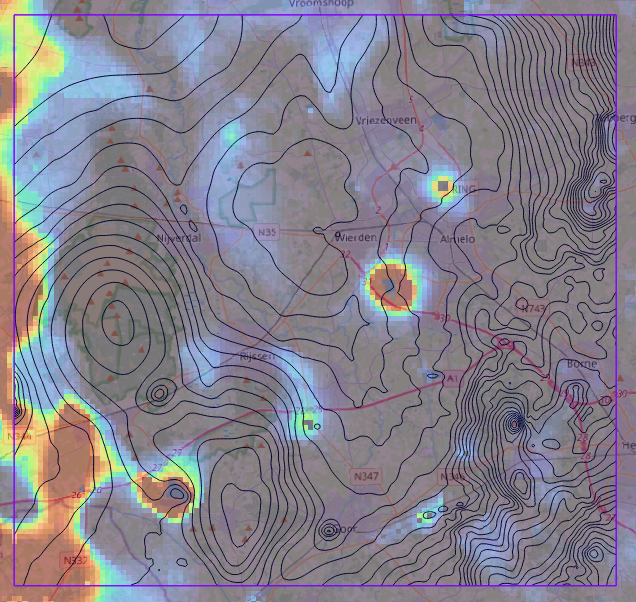

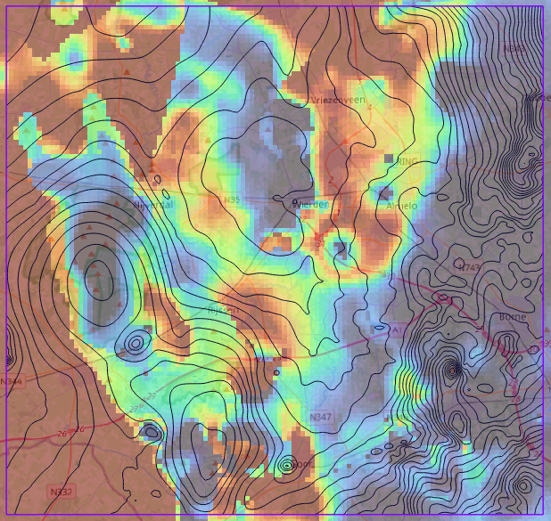

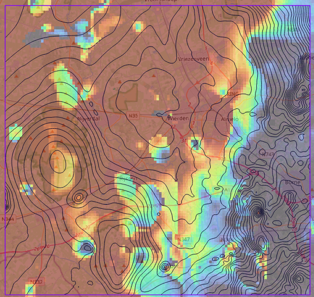

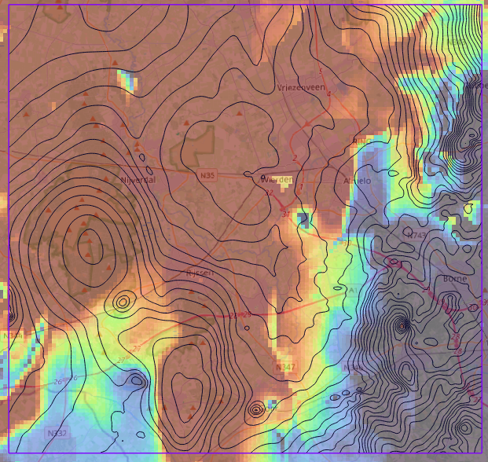

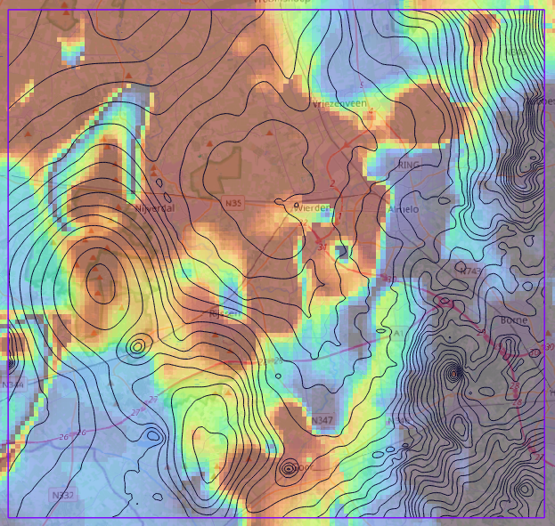

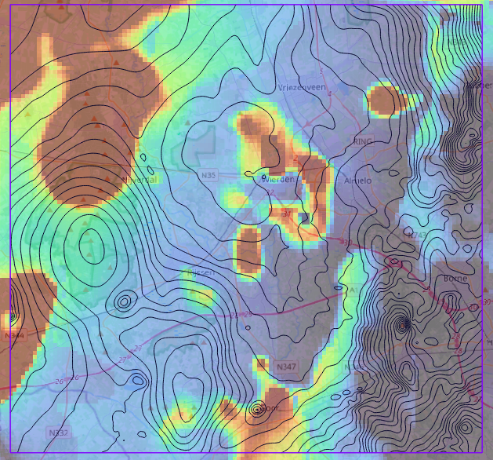

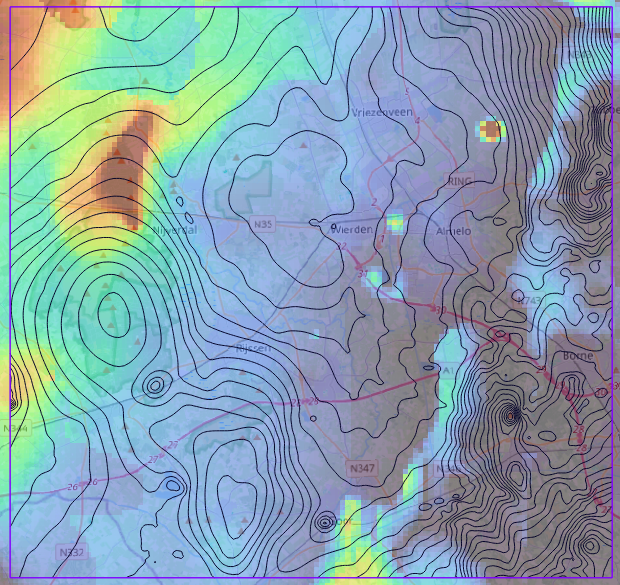

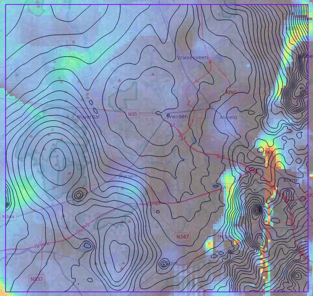

Layers with hardly any transmissivity in the Wierden region are layer 1,
7(more or less) and 8.

## Horizontal hydraulic conductivity upper aquifer

To not apply all model layers, I will aggregate these layers identifying
a top aquifer, ice-pushed ridges with relative low K's and the lower
aquifer.

Looking at the layer elevations including the ice-pushed ridges, the top
of layer 5 coincides with the bottom of the ridges:

The south-north cross section shows similar elevations:

This means that the upper 4 layers will be the upper aquifer and the
layers 5 up to 8 will then be the lower aquifer.

The horizontal conductivity is based on the sum of the upper 4 layers
divided by the sum of the thicknesses of the upper 4 layers;

$$
K_{h_{upper}}= \frac{\sum T_{1:4}}{\sum d_{1:4}}
$$

The distribution and histrogram of the horizontal conductivity of the
upper aquifer is shown in the following clip:

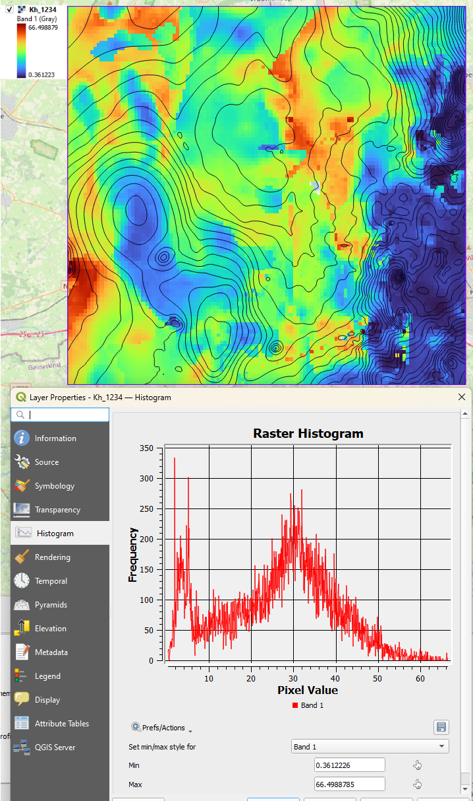

Some statistics of this upper aquifer:

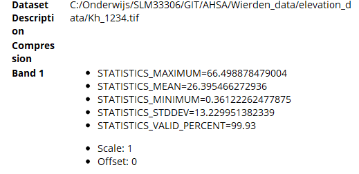

## Horizontal hydraulic conductivity lower aquifer

The upper aquifer is based on the upper four LHM4.3 layers and the lower
aquifer will be based on the lower four layers of LHM4.3.

As with the upper aquifer, the horizontal hydraulic conductivity of the
lower aquifer is calculated as:

$$ K_{h_{upper}}= \frac{\sum T_{5:8}}{\sum d_{5:8}} $$

The distribution of the horizontal conductivity of the lower aquifer is
shown in the following clip:

It seems that the highest conductivities are located in the
south_eastern part of the area.

However, a closer inspection of the summed thicknesses of the lower 5
lowers show that layers are thin or not even present. The red line
indicate the thickness of 10 m.

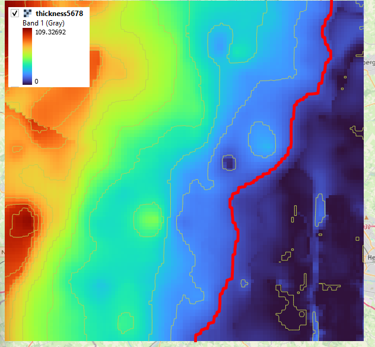

When the extreme $K_{h_{lower}}$ are filtered between 0 en 100 m/d the
following distribution appears:

The statistics of this disribution:

