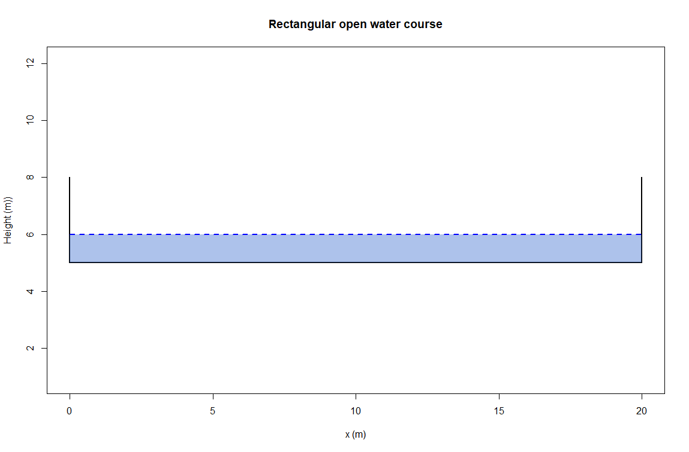
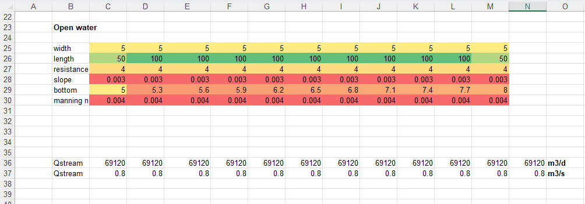
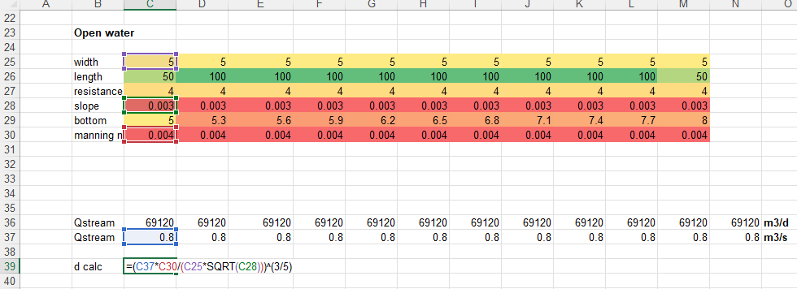
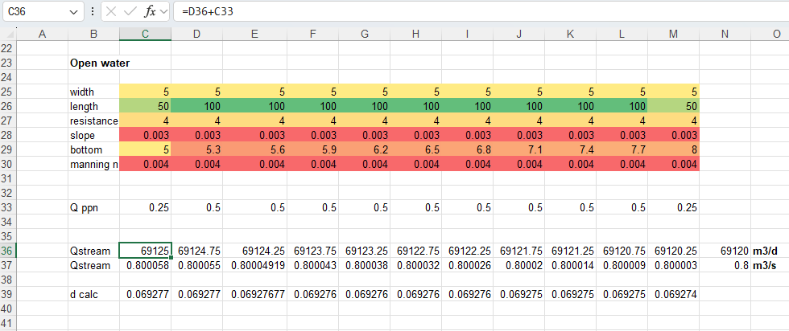
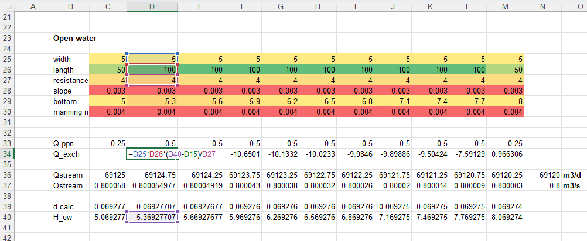

# Introduction

During the lectures and first part of the practical on Coupling and
Scale you were introduced in temporal aspects of coupling different
linear reservoirs.

You were introduced in setting up a system (set of equations) of coupled
reservoirs;
$$\frac{\partial S}{\partial t}= A_sS(t)+B_s\,\;\; S(0)=S_{init}$$

With matrix style approach, $A_s$ contains the constants of the
reservoir outlet ($T_{res}$) and $B_s$ are the external fluxes to the
reservoirs. The $S(0)$ are the initial states, which is the product of
the area of the reservoir times the head in the reservoir.

With this, since these are linear equations, you applied linear algebra
using `calcanalytical()` to get the real solution and `calcexplresult()`
and `calcimplresult()` to calculate numerical approximations of the real
solutions.

One the assignments was to create a system of coupled linear reservoirs
mimicking the coupling between open water and groundwater;

Here we are going to implement a more physical interaction between a
groundwater model and a open water model.

The groundwater is based on the Darcy equation:
$Q_{gw}=-KD\frac{\partial H}{\partial{x},y}$ and a (stationary) water
balance; $Q_{in}+Q_{out}+Q_{ext}=0$

Open water is simulated with the Manning equation:
$Q_{ow}= \frac{1}{n}\sqrt{S_o}AR^{2/3}$ .

When assuming a rectangular profile, this can be rewritten to calculate
the water depth directly with
$d=\left (\frac{Qn}{w\sqrt S_o}\right )^{3/5}$

# Groundwater model

The groundwater which will be used here is identical to the one you
maybe used during the modeling practical of Hydrogeology.

This model is based on a plan view (X-Y) one model layer (aquifer)
stationary flow systems and is ready for use but a brief description of
the workings of the model will be described here.

The general water balance equation mentioned in the introduction can
simply be rewritten to a balance describing fluxes coming from all wind
directions:

$$
Q_W + Q_N + Q_E + Q_S + Q_{ext}=0
$$

Inserting Darcy's equation into this water balance and rearranging for
dimensions/transmissivities results in:

$$
W_{coef}(H_W-H_C)+ N_{coef}(H_N - H_C)+ E_{coef}(H_E - H_C) + S_{coef}(H_S - H_C)+Q_{ext} = 0
$$

The Western coefficient $W_{coef}$ stands for:

$$
1/2\left ( KD_{NW}\frac{L_N}{L_S} + KD_{SW}\frac{L_S}{L_W}\right )
$$

The "$L$" stands for the width or height of the involved grid cells.

The other coefficients have similar equations but orientation of flow is
then rotated 90 degrees. So the western and eastern fluxes are
"horizontal" or "left right" fluxes, the northern and southern fluxes
are "vertical" of "top bottom" fluxes.

The combination of both the water balance and the fluxes from the four
wind directions results in a general equation to solve for the Head at
the current node; $H_C$:

$$
H_C=\frac{H_W W_{coef}+H_N N_{coef}+H_E E_{coef}+H_S S_{coef}+Q_{ext}}{W_{coef}+N_{coef}+E_{coef}+S_{coef}}
$$

This way the model is flexible in defining different grid dimensions for
individual rows and columns (a structured grid) and the assignment of
different transmissivities to each grid cell.

The currrent setup of the groundwater model is based on a domain of
1000m in length (West /East orientation) and 100m in width (North/South
orientation):

Main items shown in the above clip are:

-   Head distribution, the calculated heads at the center of each grid
    cell 11 x 11 (the yellow colored field)

-   Water balance groundwater, visible are recharge, boundary fluxes
    over the prescribed head at the left boundary (located column C), a
    well (if active) and the exchange of groundwater/surface water of an
    open water course located here in row 15.

-   Convergence of the solution (columns E till H, first row)

-   `relaxf` is a relaxation factor to speed up the head calculations.
    More about this later.

At the row (15) half way of the groundwater model, an open water course
will be implemented.

## Using the groundwater model

### Adjusting hydrological properties and boundary conditions

Open the groundwater model "Mesh_Model_XY.xlsx" in Excel.

As shown in the clip below, many tab sheets are present in this model.
Most sheets handle some administrative tasks to calculate the
groundwater heads. The most interesting and adjustable sheets are the
following in the red box.

Adjustable tab sheets:

-   H: Assign/Adjust Dirichlet boundary conditions to the model by
    simply assigning a value (of the head) to that cell/node replacing
    the formula. If a Dirichlet boundary condition should be replaced by
    a "H_c" formula simply copy the formula from the neighbour, except
    for the nodes where the open water course resides (row 15)

-   kd: Assign/Adjust freely the transmissivity in the domain of the
    model

-   qext: The external recharge. Here you can adjust the areal
    precipitation rate in **C3**. Optionally you may add a extraction
    well. Simply use the lable `well` to "add" this fluxrate ($m^3/d$)
    to the cell/node like :

Do not forget to assign the fluxrate of the well in cell **C6**. Note
that a positive rate means an **addition** of that rate to the model.

### Running the model

The model calculates the final heads (and later water depths of the open
water course) using an iteration scheme. It basically means that the
calculations, adjusting heads at the nodes, are repeated many times
improving the solution (i.e. the final heads) step by step. At a certain
moment these improvements are very small, making that the water balance
shows only very small errors/misfits (the `diff` in column M) in the
water balance that we can say the model is solved and the approximation
of the set of equations is satisfactory.

To set Excel into "Iteration mode" look at the clip below and do the
following;

-   1: Be sure to set iteration to manual to have full control

-   2: You may chose to Recalculate while saving but I would say NO

-   3: Be sure to check the "iterative calculation" box. Set the
    "Maximum iteration" to 1 for now to have full control over the
    iterations and the final results

With this you simply need to press the `F9` key on top of your key
board:

::: question
First assignment:

Play around with the groundwater model by adjusting for example:

-   boundary condition
-   `kd` and or `qext`
-   adding a `well`

Some examples to get acquainted with this model:

Set the Dirichlet boundary condition (column **C** ) to another value
Run the model (by pressing/holding down the `<F9>` key till the `diff`,
cell **M7** is small (1E-05 or less). If all seems to work fine in the
model, you can increase the number of iterations per `<F9>` press, see
the "Maximum iterations" field of the previous clip.

or Adjust the transmissivity of the whole of only part of the domain.
Run the model till the `diff`, cell **M7** is small (1E-05 or less)

or add an extraction or injection well in the domain. Assign a
extraction/injection rate in cell **C6** of the `q_ext` tab.
:::

# Open water flow

Hydraulics or open water flow can be simulated with the St. Venant
equations, these require specific (complicated) ways of solutions and
can be found in computer programs like Sobek, Delft3D and such. If one
is not interested in the full details of open water flow (flow along
bridges heads, through culverts) one can simplify these equations. If
one is interested in the dynamics (so time) of the open water flow, one
may want to simulate this with a kinematic wave approximation. If one is
interested in more steady state water depths one may opt for the
diffusive wave approximation. The latter will be reviewed in detail in
another lecture.

For now, we will equilibrium flow based on the Manning's equation. The
only driving force for open water flow is the bed slope of the open
water course:

$$
Q_{ow}= \frac{1}{n}\sqrt{S_o}AR^{2/3}
$$

Where:

$n$ : friction coefficient; roughness of the walls of the open water
course, vegetation..($\mathrm{sm^{-1/3}}$

$S_o$ : bed slope ($\mathrm{m/m}$)

$A$: cross sectional area $\mathrm{m^2}$

$R$: hydraulic radius ($\mathrm{m}$

If one assumes a rectangular shaped course where the width of the open
water coarse is much larger than the water depths:

With this, one can directly derive the water depth from the
aforementioned equation: $$
d=\left (\frac{Qn}{w\sqrt S_o}\right )^{3/5}
$$

## Implementing open water flow

Implementing a fully coupled system between open water and groundwater
will be carried out in a few steps;

1.  adding dimensions and hydraulic properties to the model

2.  calculating water depth in the open water course based on
    equilibrium

3.  adding precipitation to the influx of the open water course

4.  calculating the open water level w.r.t. M.S.L.

5.  calculating the exchange flux between open water and groundwater

6.  adding the exchange flux to the influx of the open water course

### Adding dimensions and hydraulic properties to the model

The dimensions and hydraulic properties which need to be added to the
model are:

-   the width, the length of the course in each cell

-   the river bed resistance, Manning's roughness coefficient

-   the bottom slope and from that the bottom elevation of the open
    water course

::: question
Add these items in the spreadsheet (H-tab) as shown in the following
clip;

Set the width to 5 m (**C25**) and copy this value up to **M25**

The length of the open water course can be calculated by the cell sizes
located in the `kd` tab sheet. Add the following formula cell **C26**:
`(kd!b8 + kd!c8)/2` and copy this until cell **M26**

Set the riverbed resistance to 4 d (**C27**) and copy this value up to
**M27**

Do the same for the bed slope, 0.003 (m/m) and Mannings roughness
coefficient `n` 0.004 (ms\^-1/3)

Set the bottom elevation of cell **C29** to 5 m. The bottom elevation of
following cell **D29** can be calculated with: `C29+(D8 - C8)*D28` .
Copy this formula up to **M29**
:::

### Calculating water depth in the open water course based on equilibrium

At this stage all parameters are known to calculate the water depth
except for the influx at the east end of the open water course.

::: question
Start with an influx of 69120 $\mathrm{m^3/d}$ , put this in cell
**N36**. Put `=N36` in cell **M36**, referring to the upstream influx.
Copy this from **M36** till **C36**.

Open water flow is determined by flux rates defined in units of
$\mathrm{m^3/s}$, the influx need to divided by the time unit: 86400.
Calculate this in row 37 as shown in the clip below, so `C36/86400` in
cell **C37** and copy this till **N37**

The water depth can now be calculated by:
$d=\left (\frac{Qn}{w\sqrt S_o}\right )^{3/5}$ in cell **C38** as shown
in the clip below:

Copy this formula up till **M39**.
:::

### Adding precipitation to the influx of the open water course

Precipitation which falls on the open water course can now be added to
the flux rate. The total amount can simply be calculated by multiplying
the area of the open water course, i.e. `width * length * qext!$C$3`

::: question
Calculate the precipitation flux for each cell and assign this to row
33. Make sure the you use the \$ signs to have an absolute reference to
the recharge rate as depicted above.

Add this recharge rate to the stream flux of each cell as shown in the
clip below:
:::

Your sheet should look like the clip below now;

Note the small impact on the newly calculated water depth. Not that
strange, precipitation is only a small fraction of the total flux rate

### Calculating the open water level w.r.t. M.S.L.

The calculated open water depths in the open water course need to be
transformed into open water levels with respect to the mean sea level.
This way the exchanges flux can be calculated based on pressure
differences, as heads with similar reference.

::: question
Calculate the open water levels `H_ow` in row **40** by adding the water
depth in row **39** to the bottom elevation located in row **29**.
:::

# Coupling open water to groundwater

## Calculating the exchange flux between open water and groundwater

The exchange flux between open water and groundwater is pressure based,
expressed as hydraulic heads between open water and groundwater (both at
a reference level, Mean Sea Level (M.S.L.). The flux encounters a
resistance for flow which depends on the local hydraulic conductivity
$K\; (\mathrm{m/d})$ and the thickness of the riverbed, expressed as a
resistance:

$$
C=\frac{d}{K}
$$

Where

$d$ : thickness of the river bed (m)

$C$ : river bed resistance (d)

The exchange flux is now calculated by:

$$
Q_{exch}= l\,w\,\frac{H_{ow}-H_{gw}}{C} \;\;[\mathrm{m^3/d} ]
$$

With:

$lw$: length times width of the course in the cell [$\mathrm{m^2}$]

$H_{ow}$ : Head open water [m]

$H_{gw}$ : Head groundwater [m]

This exchange flux is from the groundwater perspective. A gain in a flux
for the open water course is a loss of exchange flux to the groundwater
system. So in case $H_{ow}$ is higher than $H_{gw}$ , water will
infiltrate into the groundwater.

## Adding exchange flux to groundwater formula

As described in the introduction, calculation of the groundwater heads
at each node/cell, the following formula is applied:

$$ H_C=\frac{H_W W_{coef}+H_N N_{coef}+H_E E_{coef}+H_S S_{coef}+Q_{ext}}{W_{coef}+N_{coef}+E_{coef}+S_{coef}} $$

Adding the exchange flux to this formula means rewriting the exchange
flux equation to the following, containing explicit terms for the
aquifer head and the open water head:

$$
Q_{exch}= l\,w\,\frac{H_{ow}-H_{gw}}{C}\rightarrow \frac{lw}{C}H_{ow} -\frac{lw}{C}H_{gw}
$$

Adding both (separate) terms to the formula results in:

$$ H_C=\frac{H_W W_{coef}+H_N N_{coef}+H_E E_{coef}+H_S S_{coef}+Q_{ext}+\frac{lw}{C}H_{ow}}{W_{coef}+N_{coef}+E_{coef}+S_{coef}+\frac{lw}{C}} $$

::: question
Add this formula to all cells in row 15 where the open water course is
located.

The open water level is calculated in row 39, see use a cell reference
for this in the aforementioned equation
:::

Since the current Dirichlet boundary condition for groundwater is
located in column **C** one may omit the exchange flux in cell **C15**.

The following clip illustrates the implementation;

## Calculate the exchange flux rate 

The exchange flux is directly calculated within the "$H_c$" formula.

To create the exchange between open water and groundwater, working both
sides, the exchange flux need to be calculated separately and finally
added to the open water flux rate.

::: question
Calculate the exchange flux (m3/d) in row **34**.
:::

The model should look like this now;

## Double coupling open water - groundwater

At this stage the exchange flux is not considered in the calculation of
the water depth with Manning's equation.

The last step is thus simply adding the exchange flux to the open water
flux rate;

$Q_{ow}^i=Q_{ow}^{i-1}+Q_{ppn}^i+Q_{exch}^i$

Note the $i^{th}$ index, indicates that the open water flux for for
example column **D** is the open water flux of column **E** and the
precipitation and exchange flux rate of **D**

Be aware of the sign of the exchange flux

::: question
Now add all open water fluxes to row **36**
:::

If all went all right you should now have a double coupled model in
which the exchange flux between open water and groundwater is now
activated. The model should look like;

Note the adjusted water balance for the groundwater part, where the
`Q exch` (row **6**) is added. Use the Excel function
"sumif(range,criterion)" to differentiate between infiltration and
drainage; **sumif(C35:M35,"\>0")** for the infiltration to groundwater

Also note the graph indicating the bottom elevation, water depth, open
water level and the groundwater level.

# Simulation experiments
