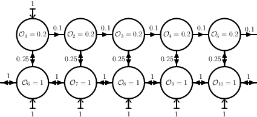
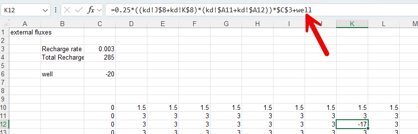
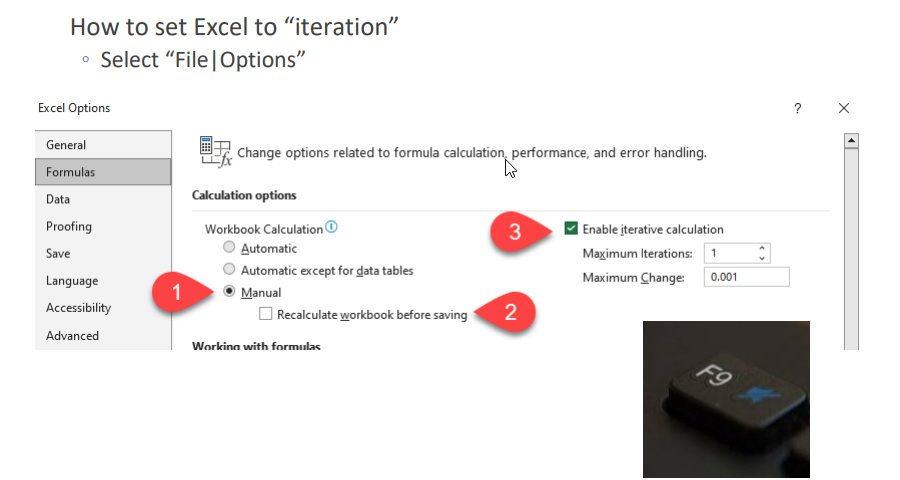

# Introduction

During the lectures and first part of the practical on Coupling and
Scale you were introduced in temporal aspects of coupling different
linear reservoirs.

You were introduced in setting up a system (set of equations) of coupled
reservoirs;
$$\frac{\partial S}{\partial t}= A_sS(t)+B_s\,\;\; S(0)=S_{init}$$

With matrix style approach, $A_s$ contains the constants of the
reservoir outlet ($T_{res}$) and $B_s$ are the external fluxes to the
reservoirs. The $S(0)$ are the initial states, which is the product of
the area of the reservoir times the head in the reservoir.

With this, since these are linear equations, you applied linear algebra
using `calcanalytical()` to get the real solution and `calcexplresult()`
and `calcimplresult()` to calculate numerical approximations of the real
solutions.

One the assignments was to create a system of coupled linear reservoirs
mimicking the coupling between open water and groundwater;

Here we are going to implement a "real" interaction between a
groundwater model and a open water model.

The groundwater is based on the Darcy equation:
$Q_{gw}=-KD\frac{\partial H}{\partial{x},y}$ and a (stationary) water
balance; $Q_{in}+Q_{out}+Q_{ext}=0$

Open water is simulated with the Manning equation:
$Q_{ow}= \frac{1}{n}\sqrt{S_o}AR^{2/3}$ .

When assuming a rectangular profile, this can be rewritten to calculate
the water depth directly with
$d=\left (\frac{Qn}{w\sqrt S_o}\right )^{3/5}$

# Groundwater model

The groundwater which will be used here is identical to the one you
maybe used during the modeling practical of Hydrogeology.

This model is base on a plan view (X-Y) one model layer (aquifer)
stationary flow systems and is ready for use but a brief description of
the workings of the model will be described here.

The general water balance equation mentioned in the introduction can
simply be rewritten to a balance describing fluxes coming from all wind
directions:

$$
Q_W + Q_N + Q_E + Q_S + Q_{ext}=0
$$

Inserting Darcy's equation into this water balance and rearranging for
dimensions/transmissivities results in:

$$
W_{coef}(H_W-H_C)+ N_{coef}(H_N - H_C)+ E_{coef}(H_E - H_C) + S_{coef}(H_S - H_C)+Q_{ext} = 0
$$

The Western coefficient stands for:

$$
1/2\left ( KD_{NW}\frac{L_N}{L_S} + KD_{SW}\frac{L_S}{L_W}\right )
$$

The "$L$" stands for the width or height of the involved grid cells.

The other coefficient have similar equations but orientation of flow is
then rotated 90 degrees. So the western and eastern fluxes are
"horizontal" or "left right" fluxes, the northern and southern fluxes
are "vertical" of "top bottom" fluxes.

The combination of both the water balance and the fluxes from the four
wind directions results in a general equation to solve for the Head at
the current node; $H_C$:

$$
H_C=\frac{H_W W_{coef}+H_N N_{coef}+H_E E_{coef}+H_S S_{coef}+Q_{ext}}{W_{coef}+N_{coef}+E_{coef}+S_{coef}}
$$

This way the model is flexible in defining different grid dimension for
individual rows and columns (a structured grid) and the assignment
different transmissivities to each grid cell.

The currrent setup of the groundwater model is based on a domain of
1000m in length (West /East orientation) and 100m in width (North/South
orientation):

Main items shown in the above clip are:

-   Head distribution, the calculated heads at the center of each grid
    cell 11 x 11

-   Water balance groundwater, visible are recharge, boundary fluxes
    over the prescribed head at the left boundary (column C)

-   Convergence of the solution (columns E till H, first row)

-   `relaxf` is a relaxation factor to speed up the head calculations.
    More about this later.

At the row (15) half way of the groundwater model, an open water course
will be implemented.

## Using the groundwater model

### Adjusting hydrological properties and boundary conditions

As shown in the clip below, many tab sheets are present in this model.
Most sheets handle some administrative tasks to calculate the
groundwater heads. The most interesting and adjustable sheets are the
following in the red box.

Adjustable tab sheets:

-   H: Assign/Adjust Dirichlet boundary conditions to the model by
    simply assigning a value to that cell/node replacing the formula. If
    a Dirichlet boundary condition should be replaced by a "H_c" formula
    simply copy the formula from the neigbour, exept for the nodes where
    the open water course resides

-   kd: Assign/Adjust freely the transmissivity in the domain of the
    model

-   qext: The external recharge. Here you can adjust the areal
    precipitation rate in **C3**. Optionally you may add a extraction
    well. Simply use the lable `well` to "add" this fluxrate ($m^3/d$)
    to the cell/node like :

Do not forget to assign the fluxrate of the well in cell **C6**. Note
that a positive rate means an **addition** of that rate to the model.

### Running the model

The model calculates the final heads (and later water depths of the open
water course) using an iteration scheme. It basically means that the
calculations, adjusting heads at the nodes, repeated many times
improving the solution (i.e. the final heads) step by step. At a certain
moment these improvements are very small, making that the water balance
shows only very small errors/misfits `diff` in the water balance that we
can say the model is solved, the approximation of the set of equations
is OK.

To set Excel into "Iteration model" do the following;

-   1: Be sure to set iteration to manual to have full control

-   2: You may chose to Recalculate while saving but I would say NO

-   3: Be sure to check the "iterative calculation" box. Set the
    "Maximum iteration" to 1 for now to have full control over the
    iterations and the final results

With this you simply need to press the `F9` key on top of your key
board:

::: question
Play around with the model by adjusting  

* boundary condition
* kd and or qext
* adding a well
:::
